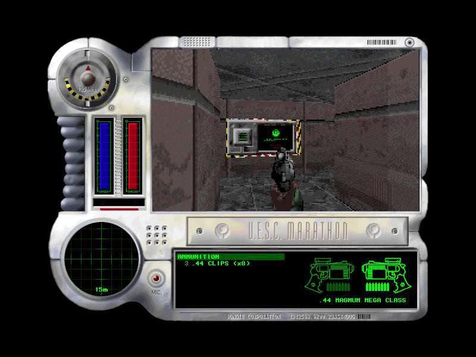
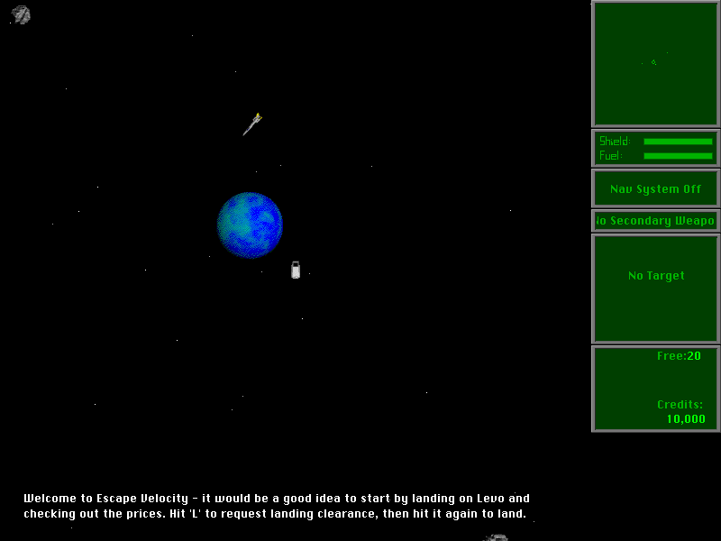

<p align="center">
  <a href="https://systemless.org/">
    
  </a>
</p>

<h1 align="center">systemless</h1>

<p align="center">
  <strong>A high-level runtime for classic Macintosh applications and games.</strong><br>
  Run original Mac software without a ROM image, System installation, or hardware emulation.
</p>

<p align="center">
  <a href="https://github.com/benletchford/systemless/actions/workflows/ci.yml"></a>
  <a href="https://crates.io/crates/systemless"></a>
  <a href="https://docs.rs/systemless"></a>
  <a href="LICENSE"></a>
</p>

Written in Rust, Systemless executes classic 68K code with the
[`m68k`](https://crates.io/crates/m68k) crate and native 32-bit PowerPC code
with the [`ppc`](https://crates.io/crates/ppc) crate. Both CPU runtimes call the
same Mac OS Toolbox and operating-system HLE implemented in native Rust. Native
builds enable m68k's Cranelift JIT for eligible hot traces, while WebAssembly
uses its portable trace executor. That lets packaged Mac applications run
without a Mac ROM image, a full System install, or hardware emulation.

## See it in action

| [Marathon](https://systemless.org/marathon) | [Escape Velocity](https://systemless.org/escape-velocity) |
| :---: | :---: |
| [](https://systemless.org/marathon) | [](https://systemless.org/escape-velocity) |

Play these and more classic Macintosh games in your browser at
[systemless.org](https://systemless.org/).

## Status

Systemless is focused on real classic Macintosh applications that use the Mac
Toolbox, whether they contain 68K CODE resources or native PowerPC PEF/CFM
fragments. The HLE covers the major runtime surfaces needed by interactive
software:

- Memory Manager handles, pointers, zones, low-memory globals, and common
  exception paths.
- Resource Manager, Segment Loader, File Manager calls, and an in-memory
  HFS-like VFS with data and resource forks.
- QuickDraw ports, regions, text, shapes, PICT, CopyBits, color tables,
  offscreen GWorlds, cursors, and 1bpp/4bpp/8bpp framebuffers.
- Event, Menu, Window, Control, Dialog, TextEdit, Cursor, Process, Sound,
  SANE, and common Toolbox utility traps.
- Cooperative Thread Manager contexts, yielding, current-thread queries,
  critical sections, and thread-entry result delivery.
- Sound Manager playback, channel state, command queues, callbacks, file
  playback, and host audio mixing.

It is not a bit-perfect Mac hardware emulator. Hardware-specific services such
as slot interrupts, device queues, removable-media behavior, and multi-process
system integration are modeled only where guest-visible behavior matters.

## Quick Start

Install with Homebrew on macOS:

```sh
brew install benletchford/tap/systemless
systemless path/to/app-or-game.sit
```

Or install from crates.io:

```sh
cargo install systemless
systemless path/to/app-or-game.sit
```

The installed `systemless` command opens a window, renders the guest framebuffer,
maps keyboard and mouse input, and enables audio when a host backend is
available.

Common runner options:

```sh
systemless --headless --max-instructions 5000000 path/to/app.sit
systemless --arrows-as-numpad path/to/game.sit
```

The desktop runner uses the canonical machine profile automatically. On macOS,
guest menus are mirrored into the native menu bar; other platforms render the
classic menu bar according to the guest application's own visibility state.

Systemless accepts StuffIt archives, MacBinary files, and raw/macOS resource forks.
Archives may contain multiple files; Systemless populates the in-memory VFS and
selects an executable resource fork from the archive.

Desktop saves are stored next to the launched archive under
`.systemless/saves/<archive-name>/`. For example, launching
`/Games/EV Override 1.0.1.sit` restores and persists saves under
`/Games/.systemless/saves/EV Override 1.0.1/`. The store preserves Mac data and
resource forks and is kept separate from the original archive.

Systemless does not ship applications, games, Mac ROMs, or Apple system software.
Use legally obtained application archives.

For a local checkout, use `cargo run --release -- path/to/app-or-game.sit`.

## Library Use

Programmatic loading goes through `FixtureRunner`:

```rust
use systemless::runner::{FixtureRunner, FixtureRunnerConfig};

let bytes = std::fs::read("game.sit").expect("read game");
let mut runner = FixtureRunner::new(32 * 1024 * 1024, FixtureRunnerConfig::default());

systemless::game::load_game(&mut runner, &bytes).expect("load game");
let (_steps, _still_running) = runner.run_steps(100_000, None);
runner.composite_frame();
```

Use `systemless::display` to render the current framebuffer for custom frontends.

## Save Persistence

Systemless keeps the guest filesystem in the runner's in-memory VFS. Persistence
is a frontend responsibility: the engine exposes snapshots of VFS files, and a
frontend decides where to store them.

Use the `FixtureRunner` VFS snapshot API for save files:

- `vfs_file_summaries()` lists VFS files with fork sizes, hashes, and metadata.
- `vfs_file_snapshot(path)` exports one file's data fork, resource fork, and
  Finder metadata.
- `import_vfs_file(snapshot)` restores a previously exported file into the VFS.
- `remove_vfs_file(path)` removes a file from the VFS.

The expected frontend sequence is:

```text
create runner
load archive into runner
record archive VFS summaries/fingerprints
load stored save snapshots
import_vfs_file(...) for each stored save
init_game(...)
periodically scan vfs_file_summaries()
persist changed user-save snapshots from vfs_file_snapshot(...)
flush one final scan on shutdown
```

Record the archive fingerprints before importing stored saves. That lets the
frontend avoid copying packaged game files into the save store and persist only
new or changed user-save files. Save-file filtering is frontend policy; common
filters exclude System Folder preferences, temporary items, Trash, and desktop
database files.

The built-in desktop runner uses this API and stores snapshots next to the
launched archive under `.systemless/saves/<archive-name>/`.

## Crate Map

| Module | Role |
| ------ | ---- |
| `game` | Shared app/archive loading, VFS population, and runner initialization. |
| `runner` | Main execution API: CPU stepping, input events, timing, audio, and frame composition. |
| `trap` | Toolbox and OS trap handlers grouped by manager. |
| `memory` | Guest RAM, low-memory globals, heap zones, handles, and pointer operations. |
| `quickdraw` | Public QuickDraw data helpers and font routing. |
| `display` | Host framebuffer and cursor rendering helpers. |
| `sound` | Sound Manager state and PCM mixing engine. |
| `loader` | 68K CODE resource and PowerPC PEF/CFM loading, relocation, and launch setup. |
| `trace` | Runtime trace hook (event/snapshot types + `TraceSink`) for cross-runtime parity comparison. |

## Build And Test

```sh
cargo build --release
cargo test --lib
cargo test --lib --features test-support   # also covers scripted_traces
cargo check --no-default-features
cargo package
```

The off-by-default `test-support` feature exposes `scripted_traces`, the
deterministic trap-replay test scaffolding. It is kept out of the published
public API; enable it only when running tests.

The default `gui` feature enables the desktop runner dependencies: `winit`,
`softbuffer`, and `cpal`. Disable default features for headless library builds.

On Linux, the default GUI/audio build also needs ALSA development files for
`cpal`'s ALSA backend. Install `pkg-config` plus your distribution's ALSA dev
package before running `cargo build --release`; for example:

```sh
sudo apt install pkg-config libasound2-dev      # Debian/Ubuntu
sudo dnf install pkgconf-pkg-config alsa-lib-devel  # Fedora/RHEL
sudo pacman -S pkgconf alsa-lib                # Arch
```

## Font Data

Systemless bundles open-source TrueType faces from URW Core 35 and rasterizes
them into cached glyph coverage when the built-in catalogue is first used.
Application-provided classic `FONT`/`NFNT` resources and local font overrides
still take precedence. The classic Mac names survive only as internal
compatibility identifiers so applications requesting a family by name or ID
resolve to an available substitute.

| Built-in face | Kind | Stands in for (compat family, font ID) |
|---------------|------|----------------------------------------|
| Nimbus Sans Bold | System / UI sans | Chicago (0) |
| Nimbus Sans | Body sans | Geneva (3), Application (1), Helvetica (21); Venice (5), London (6), Cairo (11) |
| Nimbus Mono PS | Monospace | Monaco (4), Courier (22) |
| Nimbus Roman | Serif | New York (2), Palatino (16), Times (20) |

The bundled faces cover ASCII and Mac Roman. Their antialiased coverage feeds
the existing QuickDraw glyph renderer and is thresholded only when drawing to a
1-bit destination.

Render every face on white and black backgrounds for review with
`cargo run --bin font_specimen` (output in `target/font_specimens/`).

If `SYSTEMLESS_ORIGINAL_FONTS_DIR` is set, Systemless can also load locally
generated bitmap override blobs ahead of the built-in catalogue.

### Trademark / non-affiliation

Systemless is not affiliated with, authorized by, or endorsed by Apple Inc.
Macintosh, Mac OS, QuickDraw, and the classic font family names (Chicago,
Geneva, Monaco, New York, Venice, London, Cairo, etc.) are trademarks of Apple
Inc. "Times" / "Helvetica" / "Courier" are trademarks of their respective
owners. These names appear here solely as compatibility identifiers to
interoperate with classic Macintosh software; the bundled substitutes retain
their own URW names.

### Font license

The bundled URW Core 35 files are distributed under the **SIL Open Font License
1.1**, without a Reserved Font Name clause. See
[`src/quickdraw/fonts/urw/LICENSE.md`](src/quickdraw/fonts/urw/LICENSE.md) and
[`src/quickdraw/fonts/urw/LICENSE.OFL`](src/quickdraw/fonts/urw/LICENSE.OFL).
The small Systemless menu-symbol bitmap sources remain additionally available
under the project's [OFL.txt](./OFL.txt), with "Systemless" as the Reserved Font
Name. The emulator code remains GPL-3.0-or-later.

## Useful Environment Variables

| Variable | Effect |
| -------- | ------ |
| `SYSTEMLESS_LOAD_EXECUTABLE` | Selects an executable from a multi-app archive by substring. |
| `SYSTEMLESS_ORIGINAL_FONTS_DIR` | Loads optional runtime font override blobs. |
| `SYSTEMLESS_TRACE_LOAD` | Logs archive, VFS, resource, and startup loading diagnostics. |
| `SYSTEMLESS_TRACE_LOADSEG` | Logs Segment Loader jump-table patching. |
| `SYSTEMLESS_TRACE_TRAP_COUNTS` | Prints trap dispatch frequency summaries. |

## References & Documentation Conventions

Systemless reimplements guest-visible Toolbox / OS behavior, favoring what an
application observes over cycle- or hardware-level fidelity. That behavior is a
contract, so non-obvious decisions are documented **at the code that implements
them** and cite the source that justifies them — a reader should be able to
check the reasoning without leaving the file.

**When to cite.** Add a citation whenever the "why" is not obvious from the
code: trap semantics and edge cases, magic constants and error codes, on-disk or
in-heap struct layouts, and any deliberate deviation from the books. Put it in
the `///` doc comment of the trap/function, or an inline `//` comment on the
exact line it explains.

**Inside Macintosh** is the primary source. Cite the volume, year, and page,
using `p.` for a page and `pp.` for a range:

- Old series — roman-numeral volumes; the page carries the volume prefix:
  `Inside Macintosh Volume I (1985), p. I-115`
- New series — named volumes; the page is chapter-page:
  `Inside Macintosh: Devices (1994), pp. 2-70`

A short form without the year is fine for a repeated reference in the same area
(`Inside Macintosh Volume I, I-189`). Multiple sources can back one line:
`Inside Macintosh: Files (1992), p. 2-236; Technical Note #108`.

**Other sources**, cited the same way (inline, next to the code):

- **BasiliskII** / **Executor** — when the books are silent or ambiguous, cite
  the observed behavior of an existing emulator that a matching guest relies on;
  name the file/function where it helps (e.g. `BasiliskII's fpu_ieee.cpp`).
- **Apple Technical Notes** — by number, e.g. `Technical Note #108`.

Cite only the source, never the test that checks it: comments should not name
tests, fixtures, or tooling that live outside this crate.

Prefer the narrowest source that settles the question, and always note when
Systemless intentionally diverges from it, and why.

## License

The emulator code is GPL-3.0-or-later. See [LICENSE](./LICENSE).

Bundled URW Core 35 font files and Systemless's menu-symbol artwork are
available under the SIL Open Font License 1.1; see [Font license](#font-license).
