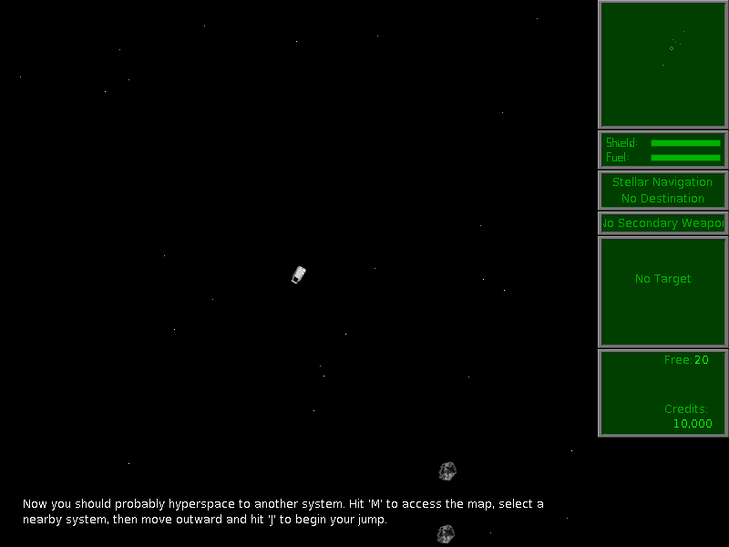

# systemless

Systemless is a high-level runtime for 68k classic Macintosh applications and
games, written in Rust.

It interprets guest 68k code with the [`m68k`](https://crates.io/crates/m68k)
crate and handles Mac OS A-line traps in native Rust. That lets packaged Mac
applications run without a Mac ROM image, a full System install, or hardware
emulation.

| Marathon | Escape Velocity |
| -------- | --------------- |
| [](https://systemless.org/marathon) | [](https://systemless.org/escape-velocity) |

Browser demos are available at <https://systemless.org/>.

## Status

Systemless is focused on real 68k applications that use the classic Mac Toolbox.
The HLE now covers the major runtime surfaces needed by interactive software:

- Memory Manager handles, pointers, zones, low-memory globals, and common
  exception paths.
- Resource Manager, Segment Loader, File Manager calls, and an in-memory
  HFS-like VFS with data and resource forks.
- QuickDraw ports, regions, text, shapes, PICT, CopyBits, color tables,
  offscreen GWorlds, cursors, and 1bpp/8bpp framebuffers.
- Event, Menu, Window, Control, Dialog, TextEdit, Cursor, Process, Sound,
  SANE, and common Toolbox utility traps.
- Sound Manager playback, channel state, command queues, callbacks, file
  playback, and host audio mixing.

It is not a bit-perfect Mac hardware emulator. Hardware-specific services such
as slot interrupts, device queues, removable-media behavior, and multi-process
system integration are modeled only where guest-visible behavior matters.

## Quick Start

```sh
cargo install systemless
systemless path/to/app-or-game.sit
```

The installed `systemless` command opens a window, renders the guest framebuffer,
maps keyboard and mouse input, and enables audio when a host backend is
available.

Common runner options:

```sh
systemless --headless --max-instructions 5000000 path/to/app.sit
systemless --arrows-as-numpad path/to/game.sit
systemless --show-menu-bar path/to/app.sit
systemless --cpu-mhz 25 path/to/app.sit
```

Systemless accepts StuffIt archives, MacBinary files, and raw/macOS resource forks.
Archives may contain multiple files; Systemless populates the in-memory VFS and
selects an executable resource fork from the archive.

Desktop saves are stored next to the launched archive under
`.systemless/saves/<archive-name>/`. For example, launching
`/Games/EV Override 1.0.1.sit` restores and persists saves under
`/Games/.systemless/saves/EV Override 1.0.1/`. The store preserves Mac data and
resource forks and is kept separate from the original archive.

Systemless does not ship applications, games, Mac ROMs, or Apple system software.
Use legally obtained application archives.

For a local checkout, use `cargo run --release -- path/to/app-or-game.sit`.

## Library Use

Programmatic loading goes through `FixtureRunner`:

```rust
use systemless::runner::{FixtureRunner, FixtureRunnerConfig};

let bytes = std::fs::read("game.sit").expect("read game");
let mut runner = FixtureRunner::new(32 * 1024 * 1024, FixtureRunnerConfig::default());

systemless::game::load_game(&mut runner, &bytes).expect("load game");
let (_steps, _still_running) = runner.run_steps(100_000, None);
runner.composite_frame();
```

Use `systemless::display` to render the current framebuffer for custom frontends.

## Save Persistence

Systemless keeps the guest filesystem in the runner's in-memory VFS. Persistence
is a frontend responsibility: the engine exposes snapshots of VFS files, and a
frontend decides where to store them.

Use the `FixtureRunner` VFS snapshot API for save files:

- `vfs_file_summaries()` lists VFS files with fork sizes, hashes, and metadata.
- `vfs_file_snapshot(path)` exports one file's data fork, resource fork, and
  Finder metadata.
- `import_vfs_file(snapshot)` restores a previously exported file into the VFS.
- `remove_vfs_file(path)` removes a file from the VFS.

The expected frontend sequence is:

```text
create runner
load archive into runner
record archive VFS summaries/fingerprints
load stored save snapshots
import_vfs_file(...) for each stored save
init_game(...)
periodically scan vfs_file_summaries()
persist changed user-save snapshots from vfs_file_snapshot(...)
flush one final scan on shutdown
```

Record the archive fingerprints before importing stored saves. That lets the
frontend avoid copying packaged game files into the save store and persist only
new or changed user-save files. Save-file filtering is frontend policy; common
filters exclude System Folder preferences, temporary items, Trash, and desktop
database files.

The built-in desktop runner uses this API and stores snapshots next to the
launched archive under `.systemless/saves/<archive-name>/`.

## Crate Map

| Module | Role |
| ------ | ---- |
| `game` | Shared app/archive loading, VFS population, and runner initialization. |
| `runner` | Main execution API: CPU stepping, input events, timing, audio, and frame composition. |
| `trap` | Toolbox and OS trap handlers grouped by manager. |
| `memory` | Guest RAM, low-memory globals, heap zones, handles, and pointer operations. |
| `quickdraw` | Public QuickDraw data helpers and font routing. |
| `display` | Host framebuffer and cursor rendering helpers. |
| `sound` | Sound Manager state and PCM mixing engine. |
| `loader` | 68k CODE resource loading and jump-table setup. |
| `oracle` | Structured event logging for reference-runtime comparison. |

## Build And Test

```sh
cargo build --release
cargo test --lib
cargo check --no-default-features
cargo package
```

The default `gui` feature enables the desktop runner dependencies: `winit`,
`softbuffer`, and `cpal`. Disable default features for headless library builds.

On Linux, the default GUI/audio build also needs ALSA development files for
`cpal`'s ALSA backend. Install `pkg-config` plus your distribution's ALSA dev
package before running `cargo build --release`; for example:

```sh
sudo apt install pkg-config libasound2-dev      # Debian/Ubuntu
sudo dnf install pkgconf-pkg-config alsa-lib-devel  # Fedora/RHEL
sudo pacman -S pkgconf alsa-lib                # Arch
```

## Font Data

Systemless does not load TTF files at runtime. The built-in DejaVu-derived glyph
bitmaps are generated into `src/quickdraw/fonts/baked.rs` and compiled into the
crate, so an installed `systemless` binary can render text without external font
files.

The TTF files under `assets/fonts/` are source assets for regenerating the baked
catalogue. If `SYSTEMLESS_ORIGINAL_FONTS_DIR` is set, Systemless can also load
locally generated bitmap override blobs ahead of the baked catalogue.

## Useful Environment Variables

| Variable | Effect |
| -------- | ------ |
| `SYSTEMLESS_LOAD_EXECUTABLE` | Selects an executable from a multi-app archive by substring. |
| `SYSTEMLESS_ORIGINAL_FONTS_DIR` | Loads optional runtime font override blobs. |
| `SYSTEMLESS_SHOW_MENU_BAR` | Shows classic Mac menu chrome by default. |
| `SYSTEMLESS_TRACE_LOAD` | Logs archive, VFS, resource, and startup loading diagnostics. |
| `SYSTEMLESS_TRACE_LOADSEG` | Logs Segment Loader jump-table patching. |
| `SYSTEMLESS_TRACE_TRAP_COUNTS` | Prints trap dispatch frequency summaries. |

## References

Trap implementations cite Inside Macintosh, BasiliskII observations, or fixture
contracts where that context is useful. The implementation favors guest-visible
behavior over cycle or hardware fidelity.

## License

GPL-3.0-or-later. See [LICENSE](./LICENSE).

Bundled DejaVu font assets are covered by their own license in
[assets/fonts/LICENSE.DejaVu.txt](assets/fonts/LICENSE.DejaVu.txt).
