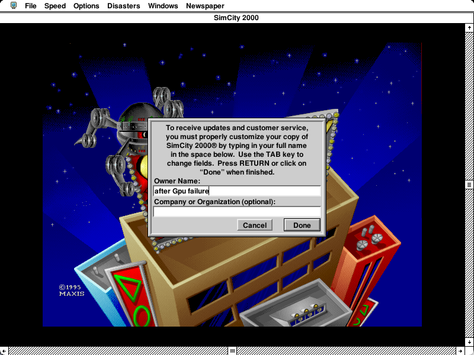
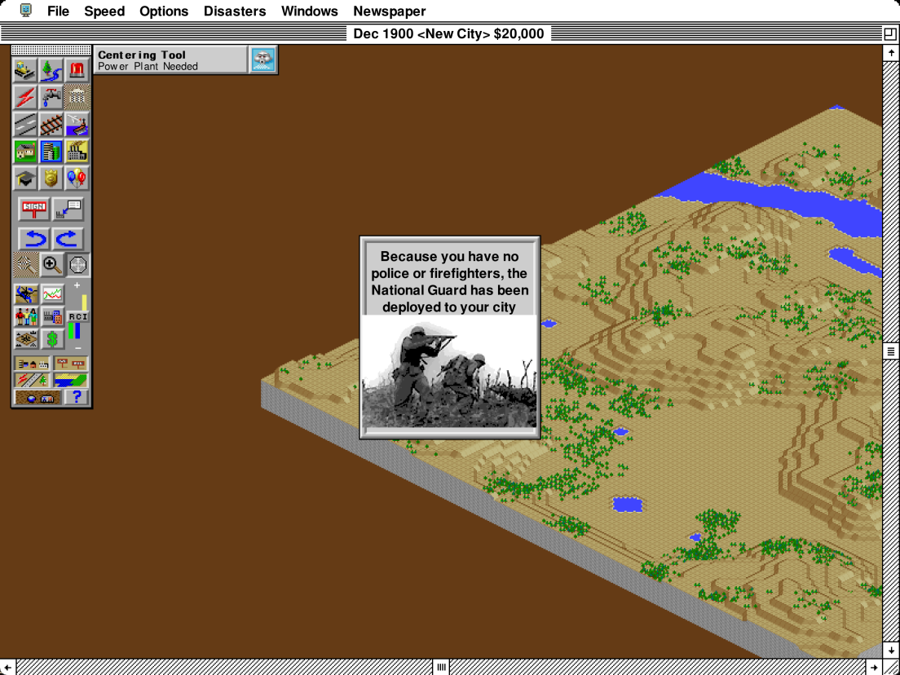
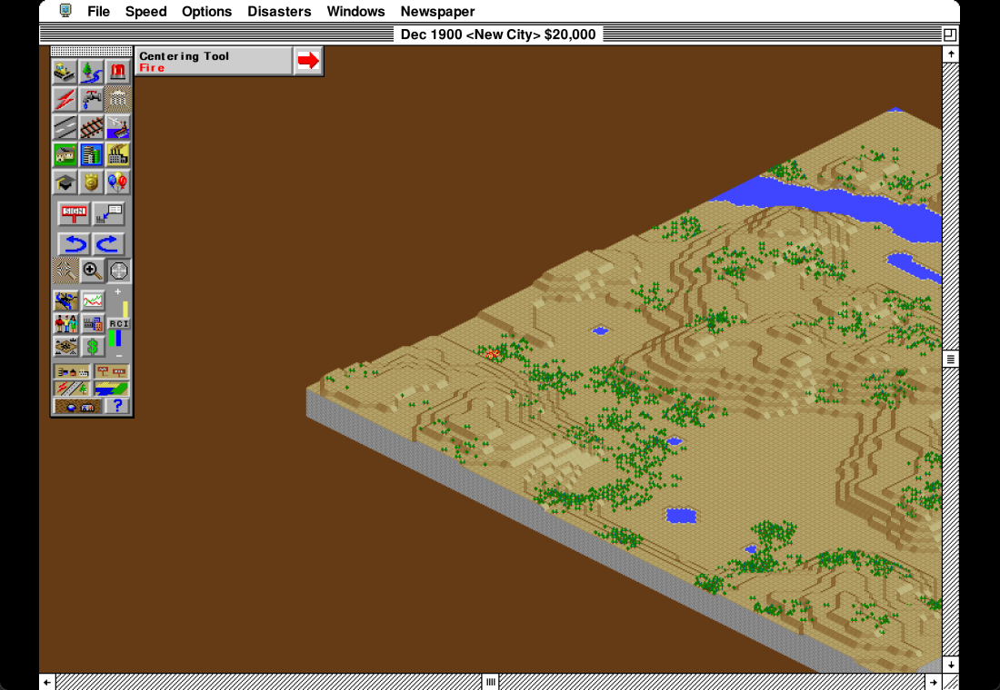
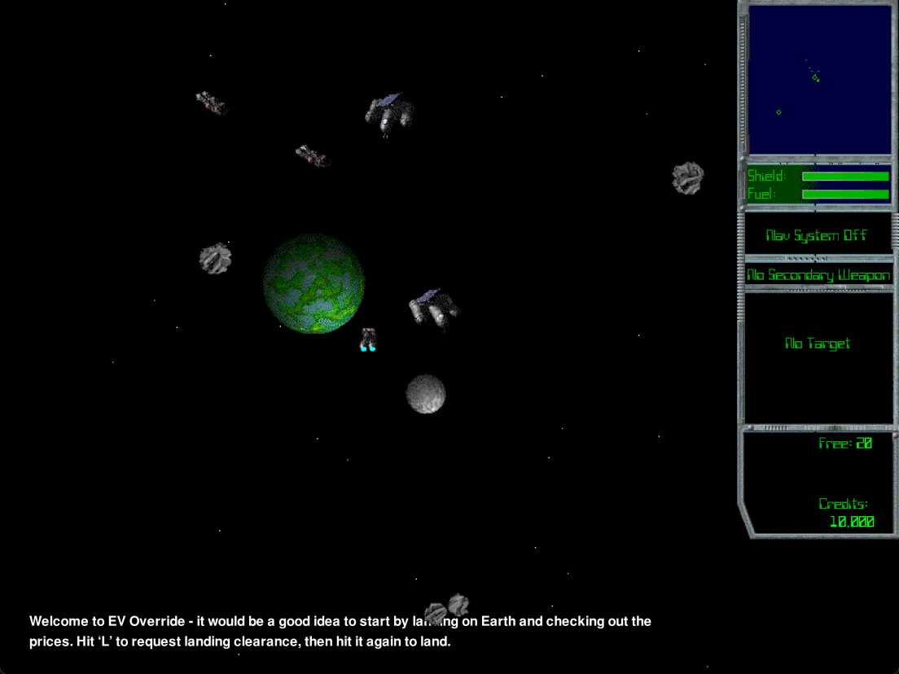
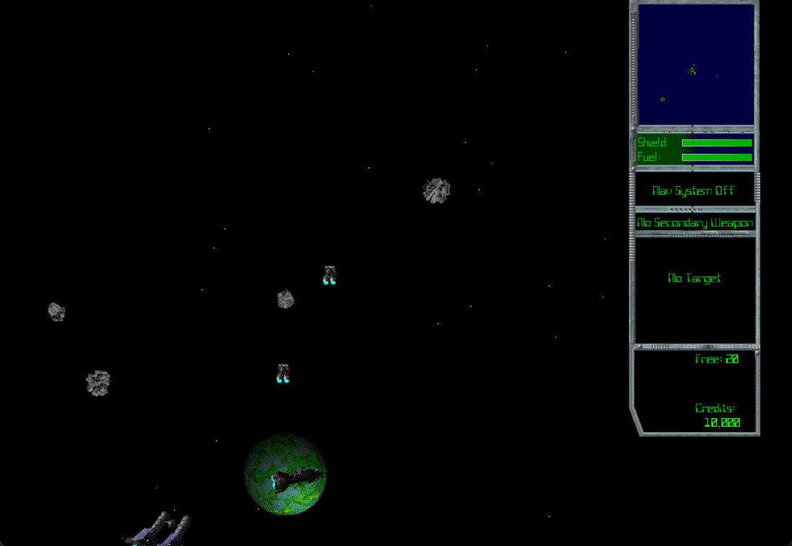

# Windows compact GPU presentation

The default Windows D3D11 backend moves final coverage integration off the Windows window thread while preserving the single-pass software image from #1997. In the final SC2K comparison, scaled-city median main-thread work fell from **20.65 ms to 6.90 ms**, and paused scaled-menu desktop-update latency fell from **69.96 ms to 41.73 ms**. Device creation or presentation errors automatically fall back to software; set `SYSTEMLESS_D3D11=0` to force software from launch.

The tested base is upstream `edf0fd4` (0.41.9), still current when checked after measurement. Coppet (#2007) is a separate change and is not in either measured configuration. This work contributes to #1724; it does not resolve every simulation or input delay.

## Image and queue design

Systemless keeps the guest's original pixels and text metrics while retaining extra host-side outline coverage for presentation. Expanding all of that coverage into a large CPU image before uploading it would spend much of the time the GPU should save. The compact transport instead sends one RGB word per ordinary logical pixel and a scale×scale tile only for cells containing retained outline samples. Indexed frames resolve their palette once during export; 16/32-bit frames combine the existing color lanes. Opaque software overlays replace affected logical cells. Unsupported sizes or representations fall back to software.

An integer pixel shader integrates area coverage and rounds once, matching the CPU filter. It does not add a bilinear filtering pass or change text rasterization. Letterboxing is cleared to black, and guest framebuffer contents, CopyBits behavior, font advances and execution timing stay under the existing guest implementation.

The app maintains one latest prepared image. A worker waits for the DXGI frame-latency event and wakes the window thread, which uploads and submits that image without advancing the guest or repeating CPU composition. A newer guest image replaces an older pending one. This avoids waiting another guest tick for an available display slot, and avoids spending several milliseconds preparing an image after the slot becomes available. All D3D calls remain on the window thread; the worker only waits on handles. Shutdown interrupts the wait and joins the worker before the DXGI handle closes.

The two-buffer flip-discard swap chain has maximum frame latency one. A nonblocking Present that reports `WAS_STILL_DRAWING` retains its permission and schedules a 1 ms retry: an unsuccessful Present is not owed a fresh readiness notification. Pending input/expose requests survive an asynchronous submission; resize rejects a pending image with obsolete dimensions. See Microsoft's [waitable-swap-chain guidance](https://learn.microsoft.com/en-us/windows/uwp/gaming/reduce-latency-with-dxgi-1-3-swap-chains) and [Present contract](https://learn.microsoft.com/en-us/windows/win32/api/dxgi/nf-dxgi-idxgiswapchain-present).

## Software fallback

The initial prototype reused the top-level HWND for softbuffer after a GPU failure. Microsoft documents that [a flip-model HWND cannot subsequently use GDI, even after the swap chain is destroyed](https://learn.microsoft.com/en-us/windows/win32/api/dxgi/ne-dxgi-dxgi_swap_effect). A simulated Present failure reproduced this: the visible picture stayed on the Maxis splash while the guest continued executing.

The swap chain now targets a disposable disabled child window. The winit parent retains focus, input and native cursor handling, and remains available for GDI. Dropping the presenter releases its D3D resources and destroys the child before releasing its parent reference. Repeating the failure probe visibly reached SC2K's registration dialog and displayed newly typed text through software rendering.

*Actual desktop capture after an injected Present failure: software rendering continues, including subsequently entered text. This is error injection, not a real driver reset.*

## Final paired measurements

September 17, 2026, 05:00–05:10 UTC. Ryzen 7 5700U / integrated AMD Radeon laptop; 1920×1080 display at approximately 60.05 Hz. Both runs recorded **AC, 98% battery, Balanced, battery saver off** before and after. GPU ran first, then software, using the same instrumented Windows release executable with only the backend switch changed. No builds, tests, other Systemless windows or GPU readback verification overlapped these runs.

Each performance stage lasted 15 seconds after settling. All eight stages had unchanged Windows last-input timestamps. Each run used a fresh archive/city; these are matched scenarios, not instruction-identical replays or a broad hardware survey.

“Main-thread work” is elapsed time around the guest/audio/render update, plus asynchronous GPU presentation retries grouped by frame. It includes CPU-side upload/submission, but not asynchronous GPU execution or physical scanout. It is not just the compact-preparation phase. The work/s column sums these elapsed intervals per second and is not whole-process CPU utilization.

| Scene / output | Software median / p95 work | GPU median / p95 work | Software / GPU work per second |
| --- | ---: | ---: | ---: |
| New City, 800×600 | 6.81 / 7.87 ms | 5.95 / 6.81 ms | 412.6 / 360.0 ms |
| New City, 1104×828 (138%) | 20.81 / 22.28 ms | 6.21 / 7.09 ms | 887.7 / 375.5 ms |
| Active city, 800×600 | 7.45 / 16.53 ms | 6.78 / 16.59 ms | 563.1 / 516.9 ms |
| Active city, 1104×828 (138%) | 20.65 / 28.83 ms | 6.90 / 16.91 ms | 878.2 / 561.4 ms |

GPU DXGI statistics reported **60.05 presentations/s** for New City at both sizes, with no missed refreshes. Active city reported **59.79/s native** and **56.99/s scaled**. There were 4 double-refresh gaps native and 46 scaled in the corresponding 15-second samples; no longer gaps. Active-city pacing therefore still has room to improve. The software city made **59.97 native / 36.46 scaled submission calls/s**; those are submission counts, not equivalent DXGI display measurements. [Microsoft's frame-statistics definitions](https://learn.microsoft.com/en-us/windows/win32/api/dxgi/ns-dxgi-dxgi_frame_statistics) explain the distinction.

### Menus

Desktop Duplication observes the first desktop image containing the dropdown after an injected physical-coordinate mouse press. Twenty trials per backend/condition all found the menu; no pointer interference was detected. No trials, including the first trial, were discarded. Injection-return overhead and observer-readback return were recorded separately. The endpoint is an **OS desktop update, not physical mouse-to-photon latency**.

| Condition | Software median / p95 / max | GPU median / p95 / max |
| --- | ---: | ---: |
| Paused city, 800×600 | 43.55 / 56.04 / 56.26 ms | 39.62 / 51.69 / 69.69 ms |
| Paused city, 1104×828 | 69.96 / 95.36 / 96.88 ms | 41.73 / 53.97 / 57.72 ms |
| Active city, 800×600 | 39.83 / 492.39 / 867.31 ms | 35.31 / 397.30 / 744.73 ms |

Scaled paused menus improve substantially. The small native difference reversed direction in an earlier pair, so this is not evidence of a reliable native-latency gain. The first GPU native trial included 23.63 ms in SendInput itself and remains in the table.

**Active-city long delays remain with both renderers.** The two GPU outliers spanned 44 and 23 guest updates and 41 and 22 accepted presentations; the longest GPU upload/submission in those intervals was 1.08 ms. The software outliers likewise spanned 29 and 51 updates/presentations. No individual measured frame in those intervals exceeded 41 ms. This rules out a single long GPU submission as their explanation; it does not establish exactly where the guest/input delay originates. Previously observed gaps between SC2K event polls are a hypothesis for separate investigation. Pausing the simulation is a controlled presentation comparison, not a fix for those delays.

### Native cursor

Each backend/size has 200 successful measured moves after ten explicitly marked warmups. The endpoint is SetCursorPos to Desktop Duplication's pointer-update timestamp; the observer-return column additionally includes acquiring/reading the update. Neither is physical scanout. All measured observations showed the custom native guest cursor.

| Output | Software pointer median / p95 | GPU pointer median / p95 | Software / GPU observer median |
| --- | ---: | ---: | ---: |
| 800×600 | 0.090 / 0.254 ms | 0.088 / 0.263 ms | 0.615 / 0.713 ms |
| 1104×828 | 0.087 / 0.224 ms | 0.091 / 0.254 ms | 0.639 / 0.684 ms |

Native cursor updates remain independent of the image presenter. These observations show no material change in their median OS update latency, and are not a claim that the GPU speeds up the cursor. See the [Desktop Duplication frame information contract](https://learn.microsoft.com/en-us/windows/win32/api/dxgi1_2/ns-dxgi1_2-dxgi_outdupl_frame_info).

## Correctness and fallback checks

- After enabling D3D11 by default, a fresh Windows GNU release build passed. With the setting absent, D3D11 initialized and all five readbacks matched 2,400,000 output pixels. With `SYSTEMLESS_D3D11=0`, no GPU presenter initialized. Actual desktop captures in both cases displayed registration and subsequently typed text. The policy switch changes presenter selection only; the paired performance measurements above used the same presenters with an explicit backend choice.
- Windows GNU release build on 0.41.9; Linux GUI `cargo check --locked --all-features --bin systemless` also passed. A production release executable on the preceding, runtime-identical 0.41.8 base completed registration, New City, newspaper, city and physical menu input through the child window.
- That production smoke run's 17 GPU readbacks matched the independent CPU oracle over 8,160,000 output pixels.
- Scripted creation failure, simulated loss after 3,000 accepted presents, and one injected busy Present all recovered and closed normally. The busy case continued GPU rendering; 32 exact readbacks covered 19,891,620 output pixels, including 800×600, 1104×828, 500×375 and 1100×760. The loss case had 14 exact readbacks before fallback. Separate actual-desktop evidence above checks that fallback visibly updates.
- EV Override 1.0.1 passed native Windows GUI pilot creation, ship naming, intro animation, flight, keyboard thrust, 800×600 / 1104×828 / 500×375 / 1100×760 resizing, and minimize/restore on the final 0.41.9 production executable. All 59 GPU readbacks exactly matched the CPU oracle over 34,299,224 output pixels; no GPU errors were reported. This was a functional check with synchronous readback enabled, not an EV performance measurement.
- The unchanged shader previously passed 313 synthetic cases / 26,107,104 output pixels against an independent CPU reference.
- Native Windows wait-worker test passed, checking one notification per arm and shutdown while waiting. The presentation suite passed 34 tests, including compact transport at 8/16/32-bit depth, retained detail, guest writes, overlays and unsupported alpha, on the same runtime base before its release-only version bump.
- The final 0.41.9 diagnostic pair completed Fire, National Guard, normal/scaled input and fully visible non-4:3 resize captures. Earlier partially offscreen captures are not used as evidence of visible resize correctness.

*Final GPU run, actual desktop capture at 1104×828: National Guard text and image after choosing Fire.*

*Final GPU run, actual desktop capture at 1100×760: Fire continues after dismissing the dialog; aspect ratio and black side borders survive resizing.*

*EV Override 1.0.1, actual desktop capture at 1104×828: gameplay after creating a pilot and ship. The 59 exact readbacks cover native, enlarged, reduced and letterboxed output; they verify agreement with the software filter, not historical-game visual accuracy.*

*Actual desktop capture after minimize/restore at 1100×760: flight continues and the black side borders preserve the original aspect ratio. The test used an isolated copy of the supplied archive and its own pilot saves.*

A compact machine-readable result set and executable/source hashes are in [results.json](windows-compact-gpu/results.json). Local raw data are named `gpu-pacing-v6-final-{selected,baseline}-a` under `target/windows-validation`; analysis uses `analyze-gpu-pacing.py` and `analyze-gpu-display-latency.py`. CPU timing used a bounded 300,000-row buffer, filled after all four CPU measurement stages; later menu/cursor measurements used independent observer CSVs. DXGI statistics were buffered separately. No per-frame synchronous timing-file writes were used.

## Running and remaining limits

Build with `cargo build --release --features gui --target x86_64-pc-windows-gnu`. Leave `SYSTEMLESS_D3D11` unset for the default GPU presenter, or set it to `0` to force software presentation. `1` also enables the GPU presenter. Native hardware cursors are independent of this choice.

`SYSTEMLESS_GPU_VERIFY=1` enables synchronous GPU readback and a full CPU oracle. Use it only for correctness checks; it materially changes timings. `SYSTEMLESS_GPU_CAPTURE_DIR` can name an existing directory for verified output images.

This was validated on one integrated AMD GPU. Actual driver removal/reset, other GPU vendors, multi-monitor/DPI transitions and live macOS behavior have not been validated here. Reported D3D errors fall back to software for the rest of the run. Active-city refresh misses and simulation-dependent input tails remain follow-up work. The backend changes Windows presentation only; shared compact export is unused by the existing macOS/Linux presenters.

## Compact export CPU follow-up (September 2026)

A later native Windows GUI sample identified CPU work in the indexed compact-export loop, including a capacity check and vector-length update for each ordinary pixel. Export now keeps the reusable cell vector at the current frame length and assigns through zipped destination/metadata slices. Every cell is overwritten on success; resize, palette resolution, detail-tile order, overlays, validation, GPU submission and guest timing retain their previous behavior.

The following is a **controlled hidden replay**, separate from the displayed-window measurements above. Two pairs ran in before/after/after/before order, each executing the same 2,500 frames including a city and Fire. The harness includes logical ARGB conversion, its overlay-reference copy, and actual compact transport generation. Phase figures are mean elapsed time per frame; whole-process figures are Windows CPU time, including startup and checkpoint overhead.

| Measurement | Before | After | Reduction |
| --- | ---: | ---: | ---: |
| Ordinary-city compact export, frames 850–999 | 1.612 ms | 1.345 ms | 16.6% |
| Fire compact export, frames 1300–2499 | 1.659 ms | 1.347 ms | 18.8% |
| Whole-process CPU, mean per 2,500-frame replay | 17.383 s | 16.578 s | 4.6% |

Both pairs improved total CPU (6.9% and 2.2%). Untouched phases varied, so these data do not establish improvements to guest execution or composition. All 2,500 non-timing frame records matched across all four runs. At four checkpoints, full 128 MiB guest RAM hashes, CPU state, rendered PNG bytes, and complete compact cell/detail bytes were identical. A regression also covers reuse across shrinking/growing frames, 8/16/32-bit color, overlays, and appearing/disappearing retained detail.

The comparison used the same combined performance stack on both sides, including the still-independent tracked-memory JIT, title cache, scalar-write routing, snapshot hashing, and #2086. Those patches are not included in this PR. The export change is independently applied to the GPU PR on master `6304dd7` (0.41.12); its library suite passed 5,515 tests (three ignored). The replay has no displayed GPU submission or live audio device; **4.6% is not a measured reduction in live GUI CPU, input latency, or a claim to meet the 7%-of-one-core target**. The shader and submitted bytes are unchanged. Prior displayed-window and GPU-oracle results above remain evidence for the presenter, rather than new measurements of this export loop.

See [compact-export-results.json](windows-compact-gpu/compact-export-results.json) for pair timings and equivalence results.
