# Toolbox showcase fixture

This directory contains the source and reproducible build for a classic
Macintosh fat application. The same `showcase.c` is compiled into a 68K
`CODE` slice and a native PowerPC PEF slice. The PEF remains in the data fork;
the 68K code, `cfrg`, menus, windows, dialogs, and other resources share the
resource fork. Both forks are committed in `toolbox-showcase.sit`.
The public coverage is tracked by issues #1078, #1081, and #1264–#1269.

The application deliberately uses ordinary Toolbox APIs rather than a private
test protocol. Its Pages menu selects thirteen interactive views:

1. Graphics exercises patterns, clipping, indexed color, lines, shapes, and
   text.
2. Controls exercises a push button, checkbox, and scroll bar. Successful
   actions appear as checkmarks in the State menu.
3. Windows creates an auxiliary document window; leaving the page disposes it.
4. Drawing & 3D Bevels exercises polygons, arcs, regions, pictures, icons,
   fonts, styles, and metrics. The PowerPC slice also builds and submits a lit
   QuickDraw 3D TriMesh through a view, camera, renderer, and draw context,
   before both slices paint the same architecture-neutral visible result.
5. Game Preferences presents a game-style configuration panel with audio
   checkboxes, difficulty and renderer radio groups, a volume scroll bar, and
   action buttons. Its settings stay synchronized with hierarchical menus.
6. Dialogs & Alerts exercises resource-backed modal dialogs, controls,
   editable text, and a system alert.
7. TextEdit exercises an interactive multiline `TERec` buffer, character
   insertion and selection, paragraph alignment (`teJustLeft`, `teJustCenter`,
   `teJustRight`), clipboard scrap operations (`TECut`, `TECopy`, `TEPaste`),
   transient wrapped text formatting (`TETextBox`), and live record metrics
   inspection.
8. Palettes activates a resource-backed mixed-usage palette, draws through
   `PmForeColor` and `PmBackColor`, translates an unrelated indexed PICT
   through a canonical offscreen GWorld into the active screen palette,
   preserves positional indexes copied from a same-identity device ColorTable
   whose RGB entries are transiently black, verifies that `RGBForeColor` uses
   the screen GDevice inverse table when the logical and hardware CLUTs differ,
   and animates explicit CLUT entries without redrawing their indexed pixels.
   Both slices record and replay the PICT through the same visible path.
9. Lists & Inventory creates a default text list with a vertical scroll bar,
   selects and inspects a cell, mutates its contents, scrolls and resizes the
   list, and toggles List Manager activation.
10. Sound & Channels creates a sampled channel, plays a format-1 `snd `
    resource, verifies SysBeep PCM, queues volume and callback commands,
    flushes and quiets the channel immediately, observes completion, and
    disposes the channel.
11. Styled Text & Fonts creates a live `TEStyleNew` record, applies multiple
    `TESetStyle` runs, inspects mixed and continuous attributes with
    `TEContinuousStyle`, resolves Geneva and Monaco through `GetFNum`/`RealFont`,
    and compares `CharWidth`, `TextWidth`, and `MeasureText` results from the
    same Font Manager state that renders the record.
12. Standard File exercises modern and legacy Open and Save entry points,
    filters the Open list to `TEXT`, navigates into the fixture folder,
    accepts a returned `FSSpec`, edits a Save name, and cancels both legacy
    paths while checking `StandardFileReply` and `SFReply` fields.
13. Resource Browser enumerates named `DATA` records with
    `Count1Resources`, `Get1IndResource`, `GetResInfo`, `GetResAttrs`, and
    `GetResourceSizeOnDisk`, then demonstrates deferred `GetNamedResource`/
    `LoadResource`, `ReleaseResource`, and reload of the same map reference.
14. Sprites, Masks & Scrolling builds an indexed offscreen scene, transfers a
    sprite through `CopyMask`, transfers a second frame through `CopyDeepMask`
    and a `BitMapToRegion` clip, samples pixels with `SetCPixel`/`GetCPixel`,
    and scrolls the existing raster with `ScrollRect`.

The menus also cover checkmarks, keyboard equivalents, three levels of
hierarchical game options, and switching menu-bar selections while a menu is
already being tracked.

These calls follow the contracts in *Inside Macintosh: Macintosh Toolbox
Essentials* (1992), Event Manager pp. 2-50–2-71, Menu Manager pp. 3-48–3-65,
Window Manager pp. 4-63–4-93, Control Manager pp. 5-78–5-96, and Dialog
Manager pp. 6-43–6-84. TextEdit follows *Inside Macintosh: Text* (1993),
pp. 2-63–2-114. The drawing surface follows *Inside Macintosh: Imaging
With QuickDraw* (1994), pp. 3-38, 3-55–3-95, and 4-68. Palette activation,
usage categories, indexed drawing, and animation follow *Inside Macintosh,
Volume VI* (1991), pp. 20-8–20-22. Lists follow *Inside Macintosh: More
Macintosh Toolbox* (1993), pp. 4-26–4-42 and 4-65–4-95.
Sound follows *Inside Macintosh: Sound* (1994), pp. 2-19–2-29, 2-92–2-101,
2-121–2-123, and 2-151–2-152.
The styled TextEdit
and Font Manager checks track public issue #1266 and follow *Inside Macintosh:
Text* (1993), pp. 2-78, 2-98–2-102, 3-81–3-82, and 4-52–4-53.
Standard File follows
*Inside Macintosh: Files* (1992), pp. 3-42–3-54.
Resource enumeration, metadata, deferred loading, handle release, and reload
follow *Inside Macintosh: More Macintosh Toolbox* (1993), pp. 1-75–1-82,
and the Resource Manager overview and lifecycle contracts are cross-checked
against *Inside Macintosh Volume I* (1985), pp. I-118–I-125.
Sprite masking, offscreen worlds, pixel sampling, regions, and scrolling
follow *Inside Macintosh: Imaging With QuickDraw* (1994), pp. 2-20–2-24,
2-43–2-50, 3-119–3-122, and 6-22–6-46.

## Rebuild and verify

Docker is the only build prerequisite. The image pins the `mps` source commit,
checks the MPW image checksum before installation, and pins `macresources`.
The fixture-local, non-publishable Rust packer pins the same released
`stuffit` crate as the runtime.

```sh
./tests/toolbox-showcase/build.sh
./tests/toolbox-showcase/build.sh --verify
```

`--verify` rebuilds the application and fails unless the resulting StuffIt
archive is byte-for-byte identical to the committed archive. Maintainers use
`--update` only when intentionally changing the fixture source or toolchain.
All intermediates remain under the ignored `build/` directory.

## Systemless interaction contract

The integration test launches the committed archive twice: the default launch
selects the 68K `CODE` slice, and the second launch selects the native PEF with
`SYSTEMLESS_PREFER_POWERPC=1`. Both runs use the same semantic assertions and
exact Systemless framebuffer references while performing the same sequence:

1. Confirm Graphics (Pages menu 129, item 1), the initial menu state, and one
   main window.
2. Choose Controls (item 2), then click the button, checkbox, and right scroll
   arrow. State menu 130 items 1–3 must become checked.
3. Choose Windows (item 3). A second window must appear and State item 4 must
   become checked.
4. Choose Drawing & 3D Bevels (item 4), verify representative QuickDraw
   output, and allow the native PowerPC QuickDraw 3D submission to complete.
5. Choose Game Preferences (item 5), change its controls, verify the matching
   hierarchical-menu checkmarks, then change menu items and verify the panel.
6. Open File → Game Options and capture the nested submenu while it is live.
7. Choose Dialogs & Alerts (item 6), open the resource-backed modal dialog,
   modify it, and confirm it with OK.
8. Invoke the system alert, capturing its live modal state on implementations
   that block for a response, then dismiss it or record its return.
9. Verify the final dialog status after both modal sessions.
10. Choose TextEdit (item 7), switch paragraph alignment to center, and capture
    the interactive buffer, `TETextBox` callout, and inspector readouts.
11. Activate the Palettes page (item 8), verify the indexed PICT → GWorld → screen
    transfer retains distinct colors across unrelated CTables, verify a
    same-device transfer retains its positional indexes through a transient
    black device ColorTable, verify `RGBForeColor` resolves through the
    indexed screen GDevice inverse table when the logical and hardware CLUTs
    differ, and capture the initial tolerant and animated-explicit color
    environment.
12. Click Animate Palette and capture the same indexed pixels recolored by
    `AnimateEntry` without repainting the swatches.
13. Open File, drag across the menu bar to Pages, and capture Graphics
    highlighted before releasing.
14. Confirm the release selected Graphics, restored the default color
    environment, and disposed the auxiliary window.
15. Activate Lists & Inventory (item 9), inspect a selected cell through
    `LGetSelect`/`LGetCell`, and capture the initial and selected list states.
16. Update the selected row with `LSetCell`, scroll with `LScroll`, and resize
    with `LSize`, capturing each resulting list state.
17. Toggle the list inactive and active with `LActivate`, capturing both
    activation states.
18. Activate Sound & Channels (item 10), verify SysBeep and `SndPlay` produce
    PCM, queue volume/callback commands, issue immediate flush/quiet, wait for
    the callback checkmark, then dispose the channel.
19. Activate Styled Text & Fonts (item 11), verify the rendered multistyled
    TextEdit and its Font Manager/measurement readouts, and capture the page.
20. Activate Standard File (item 12). Capture the page, open the modern
    filtered dialog, enter `Standard File Fixtures`, and accept its `TEXT`
    document with Return. Then cancel `SFGetFile`, accept `StandardPutFile`
    after replacing its default name, and cancel `SFPutFile`. The integration
    checkpoints are `20-standard-file-page.png`,
    `21-standard-file-open.png`, and `22-standard-file-complete.png`; the
    semantic assertions cover returned `FSSpec`/`SFReply` fields and the
    `FSpCreate`/`FSpDelete` round trip.
21. Activate Resource Browser (item 13), capture the map-only enumeration of
    `DATA` 201–203 and the `MENU`/`WIND` counts, refresh the map, load the
    named `DATA` 203 record, release its handle, and load it again. Capture
    the enumeration, loaded, and released lifecycle states.
22. Activate Sprites, Masks & Scrolling (item 14), and verify the two masked
    sprites, pixel probe, region status, and initial scene.
23. Click Animate Sprite and capture the changed source frame after the
    offscreen scene is rebuilt.
24. Click Scroll Scene and verify the sprite moves left by 24 pixels, the
    right-hand strip is repainted, and `ScrollRect` reports the exposed update
    region. The integration checkpoints are `26-sprites.png`,
    `27-sprites-animated.png`, and `28-sprites-scrolled.png`.

For a manual launch from the public repository:

```sh
cargo run --release -- tests/toolbox-showcase/toolbox-showcase.sit
SYSTEMLESS_PREFER_POWERPC=1 cargo run --release -- tests/toolbox-showcase/toolbox-showcase.sit
```

## Classic-Mac oracle runs

Expand the same `toolbox-showcase.sit` on a shared HFS volume. Launch **Toolbox
Showcase** in BasiliskII for the 68K slice and in SheepShaver for the native
PowerPC slice, then follow the twenty-four interaction steps above. Use an 800×600
8-bit display in BasiliskII and an 800×600 32-bit direct-color display in
SheepShaver for captures matching this gallery. The Pages, State, and nested
menu checkmarks, window count, control values, modal sessions, visible drawing,
and final page provide the comparison points between runs. Sound checkpoints
17 and 18 include classic-Mac captures from BasiliskII and SheepShaver; their
Systemless references document the expected PCM and callback state.

The Resource Browser checkpoint shows the same three named `DATA` records (IDs
201, 202, and 203), their stable byte sizes, clean attributes, and the
transitions `enumerated → loaded → released → reloaded`. The named-load step
leaves only `DATA` 203 resident; releasing it returns that row to an empty
handle before the reload.

The committed Standard File oracle frames show the page before interaction,
the filtered Open dialog with `Standard File Fixtures` selected, and the final
page after Open, legacy Open cancellation, editable Save acceptance, and
legacy Save cancellation. On the classic systems, the accepted Open result
names `Text Document` with type `TEXT`, the Save name is the single edited
name, and canceled calls leave `sfGood`/`good` false. Standard File window
placement and font rasterization remain presentation variance between system
software versions.

The Sprites checkpoints show the shared offscreen scene after `CopyMask` and
`CopyDeepMask`, the animated source frame, and the 24-pixel `ScrollRect`
movement with its exposed update strip. Classic-Mac rasterization and indexed
versus direct-color quantization remain presentation variance.

## Reference screenshots

These full-frame 800×600 captures all come from the same committed archive.
The Systemless images are exact RGB baselines checked by the integration test;
the classic-Mac images are human-review oracles because system fonts, desktop
patterns, and window chrome can vary between compatible OS installations.
Each existing checkpoint is paired with its corresponding classic-Mac oracle.
The frames are functional comparisons rather than whole-frame pixel-identical
targets. Palette entry selection, colors before device-depth quantization, and
animation behavior are strict comparison points rather than presentation
variance. Cursor placement can differ between captures. Checkpoints 5 and 6
use the documented final preference state: Veteran difficulty, full audio,
QD3D Bevels, and 80% volume. The PowerPC run also submits native QuickDraw 3D
geometry before the fixture paints the same architecture-neutral visible
result; classic operating-system presentation remains environment-dependent.

SheepShaver's oracle display is 32-bit direct color, so its animation checkpoint
is intentionally unchanged: *Inside Macintosh, Volume VI* (1991), p. 20-11
notes that color-table animation is unavailable on direct devices. Its
same-device transfer band likewise uses an RGB fallback because positional CLUT
indexes exist only on indexed devices. Systemless uses the same direct-color
behavior for its 16-bit PowerPC baseline; the small RGB differences in the
screenshots are the expected device-depth quantization of the same logical
colors. The Systemless 68K and BasiliskII captures exercise the actual 8-bit
indexed paths.

### 68K

| Checkpoint | Systemless | BasiliskII |
| --- | --- | --- |
| 1. Graphics |  |  |
| 2. Controls and State menu |  |  |
| 3. Windows |  |  |
| 4. Drawing and 3D fallback |  |  |
| 5. Game preferences |  |  |
| 6. Nested menus |  |  |
| 7. Modal dialog |  |  |
| 8. Alert |  |  |
| 9. Dialog result |  |  |
| 10. TextEdit |  |  |
| 11. Palette activation |  |  |
| 12. Palette animation |  |  |
| 13. Menu-bar hover |  | 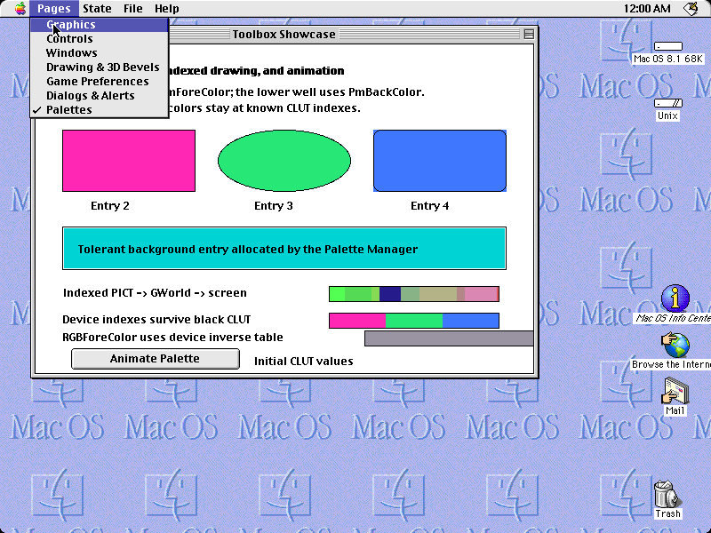 |
| 14. Palette restoration |  |  |
| 15. Lists & Inventory |  |  |
| 16. Interacted inventory list |  |  |
| 17. Sound controls |  |  |
| 18. Sound completion |  |  |
| 19. Styled Text & Fonts |  | 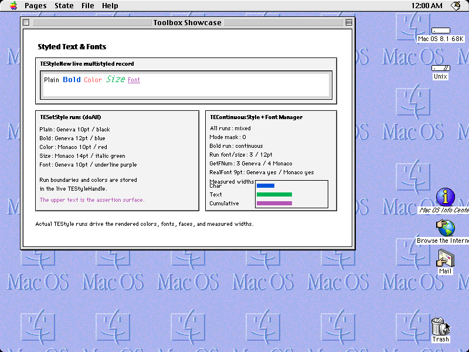 |
| 20. Standard File page |  | 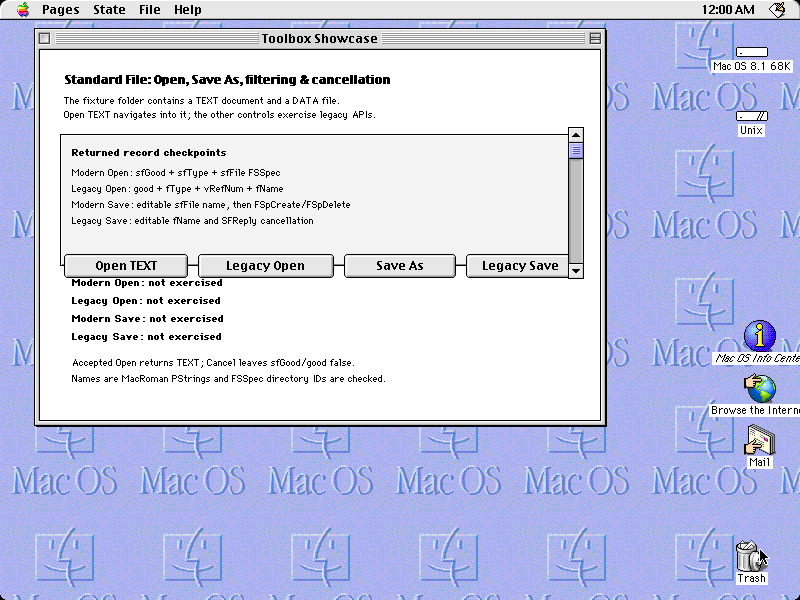 |
| 21. Standard File Open dialog |  | 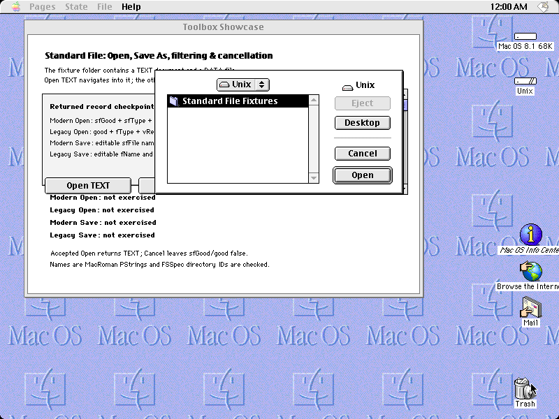 |
| 22. Standard File complete |  | 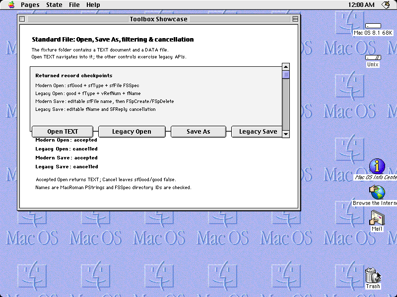 |
| 23. Resource Browser |  | 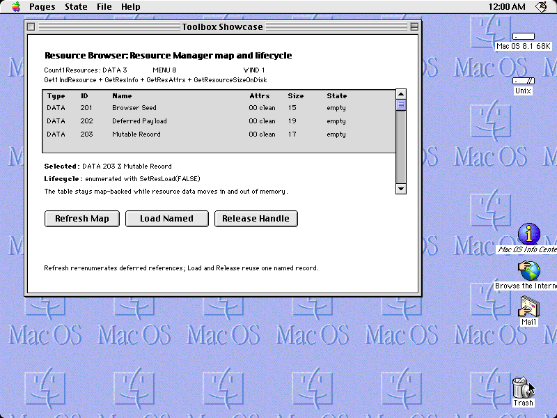 |
| 24. Resource Browser loaded |  |  |
| 25. Resource Browser released |  | 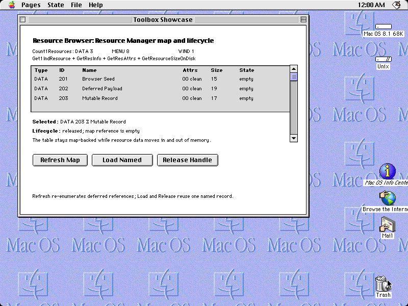 |
| 26. Sprites, masks & scrolling |  |  |
| 27. Animated sprite |  | 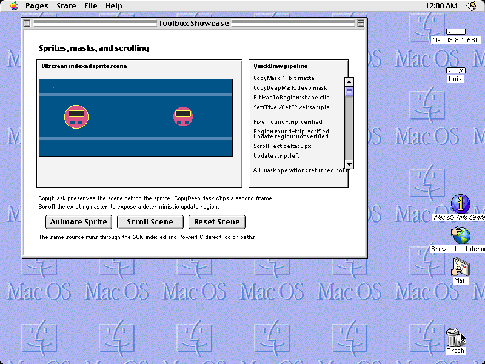 |
| 28. Scrolled sprite scene |  |  |

### PowerPC

| Checkpoint | Systemless | SheepShaver |
| --- | --- | --- |
| 1. Graphics |  |  |
| 2. Controls and State menu |  |  |
| 3. Windows |  |  |
| 4. Drawing and QuickDraw 3D |  |  |
| 5. Game preferences |  |  |
| 6. Nested menus |  |  |
| 7. Modal dialog |  |  |
| 8. Alert |  |  |
| 9. Dialog result |  |  |
| 10. TextEdit |  |  |
| 11. Palette activation |  | 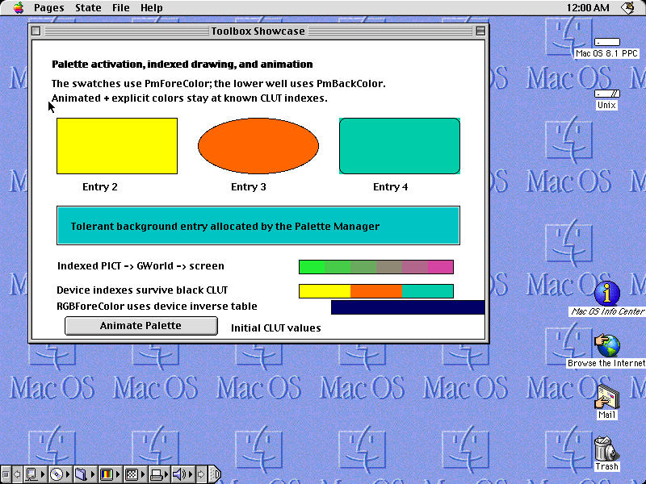 |
| 12. Palette animation |  |  |
| 13. Menu-bar hover |  | 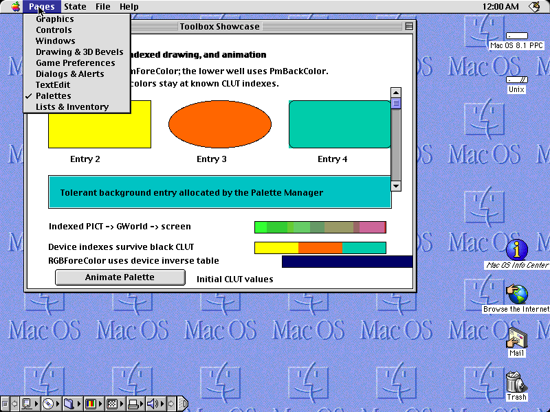 |
| 14. Palette restoration |  | 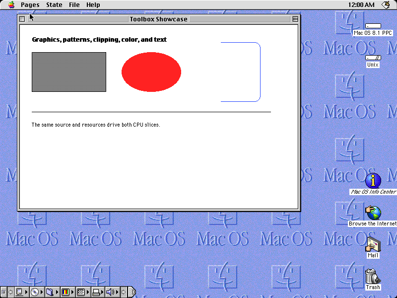 |
| 15. Lists & Inventory |  |  |
| 16. Interacted inventory list |  |  |
| 17. Sound controls |  |  |
| 18. Sound completion |  |  |
| 19. Styled Text & Fonts |  |  |
| 20. Standard File page |  | 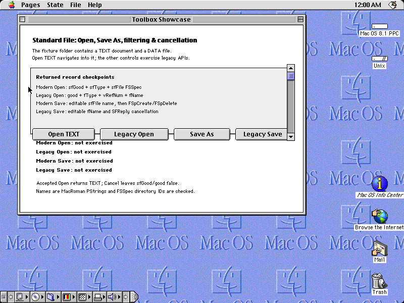 |
| 21. Standard File Open dialog |  | 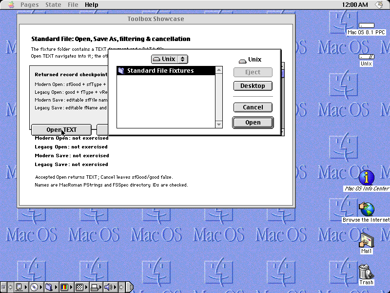 |
| 22. Standard File complete |  | 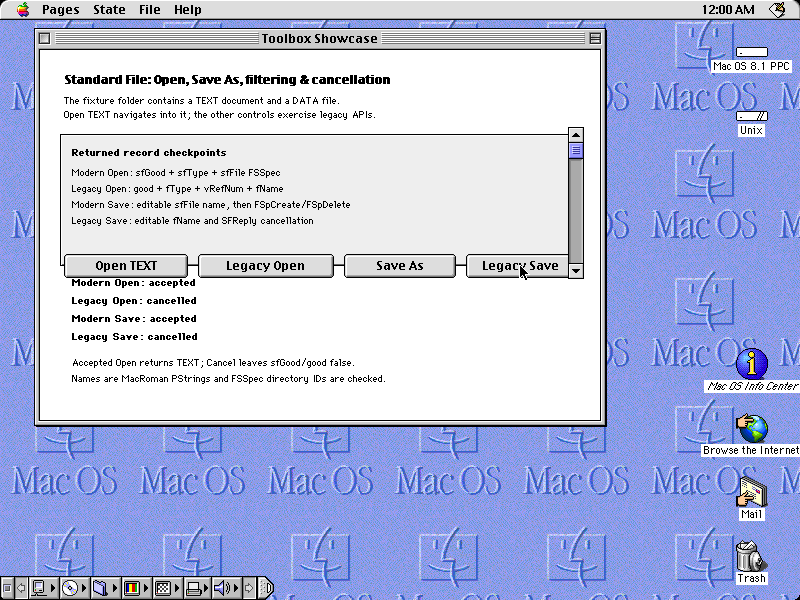 |
| 23. Resource Browser |  |  |
| 24. Resource Browser loaded |  |  |
| 25. Resource Browser released |  |  |
| 26. Sprites, masks & scrolling |  | 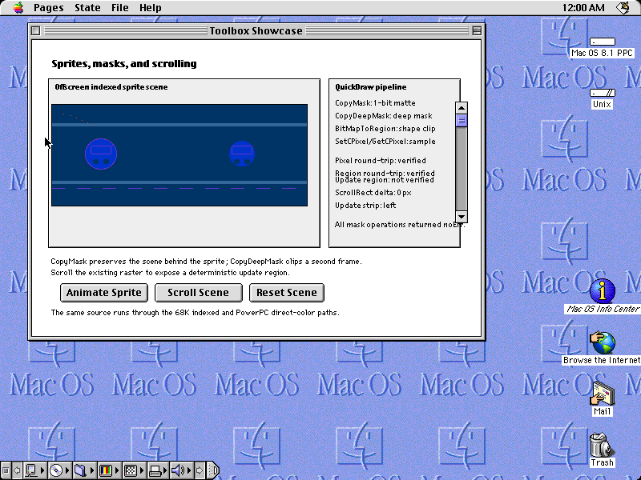 |
| 27. Animated sprite |  |  |
| 28. Scrolled sprite scene |  |  |

The test loads the `.sit` once per CPU slice, waits on semantic menu and window
state rather than relying on fixed delays, and compares all twenty-eight rendered
frames. To review and accept an intentional rendering change, regenerate the
Systemless sources and inspect the resulting PNG diff before committing it:

```sh
SYSTEMLESS_UPDATE_TOOLBOX_REFERENCES=1 cargo test --locked --test toolbox_showcase
SYSTEMLESS_PREFER_POWERPC=1 SYSTEMLESS_UPDATE_TOOLBOX_REFERENCES=1 cargo test --locked --test toolbox_showcase
```
