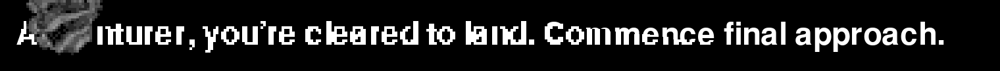
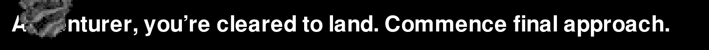
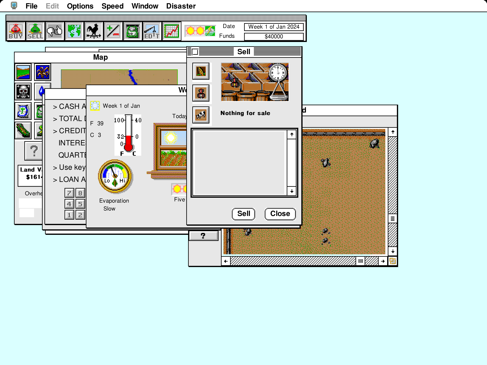

# Outline font Toolbox Showcase

These captures run the actual 68k Toolbox Showcase with the default bundled
TrueType fonts, Classic System 7 theme and a fixed startup clock. The guest
screen remains 800 × 600 at 8-bit depth. The capture test retains 4× glyph coverage. Desktop output selects the
smallest integer scale covering the drawable (1×–4×), composing directly into
a reused output buffer, caching resolved pixels until drawing or the palette
changes. A 2× window no longer expands a full 4× output frame.

The complete review galleries now cover both 68K and PowerPC through the shared
4× presentation surface: 59 interaction checkpoints per architecture. Guest
pixel baselines remain separate and are still checked exactly. First-paint tests
exercise lists and text input before and after copying, window movement and typing
on both CPU architectures. Desktop ARGB and browser RGBA output are checked for
pixel parity, and software minification is compared with Metal output.

Images labelled **before** are archived regression evidence and intentionally
remain unchanged, as do the BasiliskII/SheepShaver oracle captures. The Escape
Velocity comparison below is retained from its separate dialog investigation.
For the final Mac window appearance, use the [Metal output](#final-mac-window-scaling);
the guest-resolution reference tables do not show the desktop's sharp text layer.

The [complete review galleries](../README.md#68k-desktop-presentation)
also capture every window, menu, dialog, selection and page transition through
the 4× presentation surface. The five-page table here is a scale comparison.

| Page | 2× (1600 × 1200) | 4× (3200 × 2400) |
| --- | --- | --- |
| TextEdit | [Open](2x/textedit.png) | [Open](4x/textedit.png) |
| Styled text | [Open](2x/styled-text.png) | [Open](4x/styled-text.png) |
| Drawing | [Open](2x/drawing.png) | [Open](4x/drawing.png) |
| Controls | [Open](2x/controls.png) | [Open](4x/controls.png) |
| Graphics | [Open](2x/graphics.png) | [Open](4x/graphics.png) |


## Reproduce

```sh
./tests/toolbox-showcase/build.sh --verify
SYSTEMLESS_FONT_EVIDENCE_DIR=tests/toolbox-showcase/outline-fonts \
cargo test --no-default-features --test toolbox_showcase \
  capture_outline_font_showcase -- --ignored --nocapture
```

The capture test repeats five pages with presentation disabled, at 2× and at
4×. Every enlarged run must preserve the fresh baseline's guest framebuffer,
execute real outline draws, and differ from nearest-neighbor enlargement.
TextEdit contents, style state and measured-width bars are also checked.
Only the ten lossless gallery PNGs are generated.

The complete interaction test passes separately on both 68k and PowerPC:

```sh
cargo test --no-default-features --test toolbox_showcase test_toolbox_showcase -- --exact
SYSTEMLESS_PREFER_POWERPC=1 cargo test --no-default-features \
  --test toolbox_showcase test_toolbox_showcase -- --exact
```

The [guest-resolution reference gallery](../README.md#reference-screenshots)
was regenerated for both architectures. Changed metrics intentionally affect
wrapping and selection: this TextEdit sample wraps into five lines, and its
fixed mouse drag selects 14 characters. Layout probes sample borders and
backgrounds rather than relying on the old font's ink at a particular pixel.
The archive rebuilt byte-for-byte with the cached pinned toolchain image;
Docker's registry metadata lookup was unavailable.

## First paint after palette changes

The desktop refreshes the display palette between CPU slices. The regression
visits the palette page before opening Lists and TextEdit, then compares their
fresh text pixels with a full repaint after dragging the window. TextEdit is
also checked after inserting and deleting a character. Both comparisons must
be byte-identical. Each page also goes through a screen-to-offscreen copy,
a complete screen overwrite, and restoration without a guest repaint; its
full-resolution pixels must match exactly. The regression fails against the previous implementation
(`d86e44e6`); [its fresh Lists capture](first-paint/lists-before-fix.png)
reproduces the patchy text. These fixed captures are taken before the drag or typing:


[Lists after dragging](first-paint/lists-after-drag.png) ·
[TextEdit after dragging](first-paint/textedit-after-drag.png) ·
[Lists after offscreen restoration](first-paint/lists-after-copy.png) ·
[TextEdit after offscreen restoration](first-paint/textedit-after-copy.png)

```sh
SYSTEMLESS_FIRST_PAINT_EVIDENCE_DIR=tests/toolbox-showcase/outline-fonts/first-paint \
cargo test --no-default-features --test toolbox_showcase \
  first_page_outlines_survive_palette_changes -- --exact
```

Palette updates now recolor retained coverage through its original palette
indexes, including antialiased edges and overlapping colors. They no longer
recreate the display from the lower-resolution guest framebuffer.

## Final Mac window scaling

The full 4× captures above show retained coverage. The desktop first resolves
that coverage to the output scale, then the GPU handles any fractional reduction.
Nearest sampling at that last step dropped thin strokes even when the source
image was correct. The Mac shader now integrates source pixel coverage when
shrinking; enlargement retains nearest sampling.

These images are read back from the actual Metal presentation shader at
960 × 696 pixels, matching an 800 × 580 guest area after hiding the menu bar:

| Previous nearest reduction | Coverage-preserving reduction |
| --- | --- |
| [Open](mac-window/textedit-before.png) | [Open](mac-window/textedit.png) |


The GPU regression checks exact coverage at integral and fractional reductions
and unchanged nearest enlargement. It fails on the previous shader. On macOS:

```sh
cargo test --bin systemless minification_retains_thin_strokes_between_sample_centers
SYSTEMLESS_METAL_FONT_CAPTURE=tests/toolbox-showcase/outline-fonts/mac-window/textedit.png \
cargo test --bin systemless capture_showcase_at_mac_window_size -- --ignored
```

## Escape Velocity dialogs

Escape Velocity 1.0.5 exposed two host snapshot paths absent from the single
showcase page: replaying a cached modal dialog, and preserving the front dialog
while repainting the window behind it. Replaying unchanged bytes now retains
outline detail. Changed bytes still restore, and guest writes still invalidate
text even when their values match the current framebuffer.

Dialog selection highlighting now inverts retained palette indexes and outline
coverage together. The real New Pilot dialog was checked after 100 refresh
slices, including its selected name. These dialog crops were reduced by the
production Metal shader to 556 × 310 pixels:

| Previous replay and selection | Fixed replay and selection |
| --- | --- |
|  |  |

The small explanatory paragraph is a picture supplied by EV and remains bitmap
artwork. The pilot names are generated by the game. No game archive is included.
The regression checks repeated dialog/occluder restores, changed pixels, ordinary
guest erases, and lossless double inversion of antialiased indexed coverage.

```sh
cargo test --no-default-features --lib dialog_snapshot_replay_retains_unchanged_outline_detail
cargo test --no-default-features --lib memory::presentation::tests
```

## Rendering scope

Bundled URW and Noto outlines replace the hand-drawn font catalogue. Guest
bitmap/outline resources and explicit local overrides retain precedence.
See [URW provenance](../../../src/quickdraw/fonts/urw/README.md) and
[Noto provenance](../../../src/quickdraw/fonts/noto/README.md).

The shared presentation retains 68K and PowerPC outline text on indexed and
direct-color screens and offscreen buffers, including synthesized bold, italic, underline,
outline and shadow styles, plus shared chrome and menu symbols. The guest's binary framebuffer and text advances remain unchanged
by presentation. Visibility and clipping regions constrain the enlarged ink;
repeated coverage does not darken edges, and opaque text runs preserve
adjacent overhangs. Cursor and debug overlays retain guest coordinates.

Owned dialog, menu, control and window snapshots retain indexed subpixels.
Indexed CopyBits, ScrollRect, BlockMove, palette translation and selection
inversions carry that coverage through their operations. Palette changes
recolor the retained indexes. Ordinary guest erases still replace coverage.

Desktop ARGB and browser RGBA use the same coverage resolver. Monochrome and
unsupported drawing modes keep their logical raster. Standard push button
corners retain the same curved coverage on both CPU architectures; bitmap
artwork and custom controls retain their original pixels.

Styled TextEdit measures each run using its own font, size and face. A condensed
heading no longer causes later plain text to wrap using underestimated widths.
Font substitutions can still change layout compared with the original fonts;
presentation resolution does not change those metrics.

## Preservation regressions

The trap regression draws real outline text and round-trips it through both
CopyBits entry paths, an offscreen PixMap, ScrollRect and InvertRect. Separate
checks cover completely occluded dialog/menu/window snapshots, overlapping
copies, palette remapping, transparent/Boolean transfers and invalidation by
ordinary guest writes. These compare physical pixels without a repair repaint.

```sh
cargo test --no-default-features --lib outline_detail_survives
cargo test --no-default-features --lib memory::presentation::tests
cargo test --no-default-features --lib dialog_snapshot_replay_retains_unchanged_outline_detail
```

### Direct CPU background copies

Escape Velocity 1.0.5 saves and restores sprite backgrounds with memory-to-memory
`MOVE` instructions. Those copies now carry retained glyph coverage through the
CPU bus using the published `m68k` 0.13.0 copy callbacks, including offscreen saves and overlapping destinations. Ordinary stores
still erase coverage, even when the logical byte value is unchanged. Copies
without retained detail skip the completion callback.

The captures below show the same status message after an asteroid crosses it.
All 32 logical framebuffer captures in the reproduction are identical before
and after the fix. In the area already cleared by the asteroid, all 1,556
original detailed cells return exactly; previously only 573 remained intact.
The asteroid can temporarily cover the text, and the message still clears when
its display interval expires.

In sequential headless runs on the same Apple M1, median throughput during the
copy-heavy message interval was 23.4 million instructions/s before and 20.6
after (13 one-million-instruction samples each, approximately 14% additional
execution time). This compares the complete candidate, including its CPU update;
it is not a displayed-FPS or audio-continuity measurement.

| Before | After |
| --- | --- |
|  |  |

## Dialog performance

An unchanged modal filter no longer redraws and snapshots standard items on
return. Snapshots share immutable detail until a write changes it; a drawing
revision also skips a repeated restore of the same snapshot. An unchanged
palette refresh does not invalidate a filter or the resolved output. Ordinary writes,
including same-byte writes over text, invalidate this reuse.

The opt-in timing test accepts a locally obtained archive; it commits no game
assets. It reaches the first modal dialog, settles it, and reports execution,
additional composition, and presentation separately. These phase timings do
not measure host audio underruns or displayed FPS, and execution can already
include composition. Use the same build profile and machine for comparisons.

```sh
SYSTEMLESS_PROFILE_ARCHIVE=/path/to/game.sit \
SYSTEMLESS_PROFILE_OUTPUT_SCALE=2 SYSTEMLESS_PROFILE_FRAMES=300 \
cargo test --profile ci-test --no-default-features --test presentation_performance \
  -- --ignored --nocapture
```

`SYSTEMLESS_PROFILE_IMAGE` optionally saves a retained-resolution screenshot.
`SYSTEMLESS_PROFILE_BOOT_SLICES` profiles a fixed number of boot slices instead
of waiting for a modal dialog. Output scaling does not require discarding
already-retained 4× glyph detail when the window moves between displays.

### EV Override review measurements

On the same Apple M1 host, using `ci-test`, 50,000 instructions per slice,
735 requested audio samples and 1,000 warm slices:

| EV Override modal phase | `master` (`241d021f6`), logical output | Revised renderer, 2× output |
| --- | --- | --- |
| Execution mean / p95 | 0.30 / 0.41 ms | 0.62 / 0.90 ms |
| Additional composition mean | 0.006 ms | 0.0005 ms |
| Presentation mean / p95 | 0.21 / 0.24 ms | 0.82 / 0.89 ms |

The earlier font PR revision (`f4d85c094`) averaged 29.19 ms for execution,
13.65 ms for additional composition and 8.85 ms for full 4× output in its
warm modal probe. The revised path keeps cached 4× detail but resolves only the
requested output size, reusing the result until it changes. Output formats
and font quality differ from `master`; these are cost comparisons, not an
assertion of identical images. Execution includes some composition, so adding
the phases does not give a displayed frame rate.

A separate 1,000-slice Marathon demo probe, after 5,000 boot slices, averaged
0.36 ms execution and 1.34 ms presentation (p95: 0.49 and 3.95 ms). It exercises
an animated viewport with retained HUD text. These tests do not establish
live audio continuity or FPS on the reviewer's Intel Mac.

The registration text now wraps using each style run's own metrics. The
condensed heading cannot change the width used for following plain paragraphs:

| Previous layout on `master` | Corrected layout and sharp control corners |
| --- | --- |
| [Open](ev/override-registration-before.png) | [Open](ev/override-registration.png) |

## Overlapping gameplay windows

SimFarm's window cycling exposed two generic Window Manager costs. A retained
`DragTheRgn` repainted its outline on every polling call, even with no mouse
movement. Frame redraws also saved and restored entire overlapping window
interiors to protect front windows from border painting.

Stationary region tracking now reuses its outline. Frame preservation is limited
to the title, border and shadow areas that can actually be painted, with duplicate
overlap removed. `DrawGrowIcon` protects its size box and scrollbar separator lines. Front windows
remain protected; movement, leaving the drag slop rectangle and reentering it still
update the outline.

A deterministic SimFarm run moves the farm window, opens the toolbar gameplay
windows and revisits them through 14 toolbar selections. All 26 logical captures
and their 26 retained-detail captures are byte-identical before and after this
change. A longer run completes 48 additional toolbar selections without locking
up, while the game clock advances. On the same Apple M1, sequential headless
development builds showed:

| Operation | Previous PR head | Corrected renderer |
| --- | --- | --- |
| Drag polling, roughly 100,000 instructions per slice | 8.9–9.9 seconds per slice | No slow-slice reports |
| Later window cycling, median throughput | 1.7 million instructions/s | 5.9 million instructions/s |

These are headless execution measurements, not live FPS or cross-platform
benchmark claims.
The fixes use the shared Rust Window Manager and require no platform backend.


