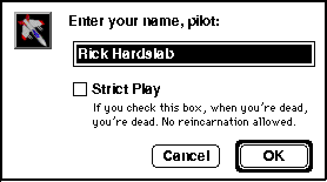

# Outline font Toolbox Showcase

These captures run the actual 68k Toolbox Showcase with the default bundled
TrueType fonts, Classic System 7 theme and a fixed startup clock. The guest
screen remains 800 × 600 at 8-bit depth. The desktop uses the same 4× surface
initialization as the capture test.

Refreshed on 6 September 2026 against renderer revision
[`c1c95e3`](https://github.com/benletchford/systemless/commit/c1c95e3cb47d539bae1cd9a8a20dc5602ff4c52d):
116 guest-reference frames across 68k and PowerPC, ten enlarged page captures,
six first-paint/restore captures and one final Metal capture. All 133 regenerated
images retain the previous decoded pixels; the performance fixes preserve their
appearance. Both architecture suites also passed against the regenerated references
with update mode disabled.

Images labelled **before** are archived regression evidence and intentionally
remain unchanged, as do the BasiliskII/SheepShaver oracle captures. The Escape
Velocity comparison below is retained from its separate dialog investigation.
For the final Mac window appearance, use the [Metal output](#final-mac-window-scaling);
the guest-resolution reference tables do not show the desktop's sharp text layer.

The [complete 58-checkpoint review gallery](../README.md#68k-desktop-presentation)
also captures every window, menu, dialog, selection and page transition through
the 4× presentation surface. The five-page table here is a scale comparison.

| Page | 2× (1600 × 1200) | 4× (3200 × 2400) |
| --- | --- | --- |
| TextEdit | [Open](2x/textedit.png) | [Open](4x/textedit.png) |
| Styled text | [Open](2x/styled-text.png) | [Open](4x/styled-text.png) |
| Drawing | [Open](2x/drawing.png) | [Open](4x/drawing.png) |
| Controls | [Open](2x/controls.png) | [Open](4x/controls.png) |
| Graphics | [Open](2x/graphics.png) | [Open](4x/graphics.png) |


## Reproduce

```sh
./tests/toolbox-showcase/build.sh --verify
SYSTEMLESS_FONT_EVIDENCE_DIR=tests/toolbox-showcase/outline-fonts \
cargo test --no-default-features --test toolbox_showcase \
  capture_outline_font_showcase -- --ignored --nocapture
```

The capture test repeats five pages with presentation disabled, at 2× and at
4×. Every enlarged run must preserve the fresh baseline's guest framebuffer,
execute real outline draws, and differ from nearest-neighbor enlargement.
TextEdit contents, style state and measured-width bars are also checked.
Only the ten lossless gallery PNGs are generated.

The complete interaction test passes separately on both 68k and PowerPC:

```sh
cargo test --no-default-features --test toolbox_showcase test_toolbox_showcase -- --exact
SYSTEMLESS_PREFER_POWERPC=1 cargo test --no-default-features \
  --test toolbox_showcase test_toolbox_showcase -- --exact
```

The [guest-resolution reference gallery](../README.md#reference-screenshots)
was regenerated for both architectures. Changed metrics intentionally affect
wrapping and selection: this TextEdit sample wraps into five lines, and its
fixed mouse drag selects 16 characters. Layout probes sample borders and
backgrounds rather than relying on the old font's ink at a particular pixel.
The archive rebuilt byte-for-byte with the cached pinned toolchain image;
Docker's registry metadata lookup was unavailable.

## First paint after palette changes

The desktop refreshes the display palette between CPU slices. The regression
visits the palette page before opening Lists and TextEdit, then compares their
fresh text pixels with a full repaint after dragging the window. TextEdit is
also checked after inserting and deleting a character. Both comparisons must
be byte-identical. Each page also goes through a screen-to-offscreen copy,
a complete screen overwrite, and restoration without a guest repaint; its
full-resolution pixels must match exactly. The regression fails against the previous implementation
(`d86e44e6`); [its fresh Lists capture](first-paint/lists-before-fix.png)
reproduces the patchy text. These fixed captures are taken before the drag or typing:


[Lists after dragging](first-paint/lists-after-drag.png) ·
[TextEdit after dragging](first-paint/textedit-after-drag.png) ·
[Lists after offscreen restoration](first-paint/lists-after-copy.png) ·
[TextEdit after offscreen restoration](first-paint/textedit-after-copy.png)

```sh
SYSTEMLESS_FIRST_PAINT_EVIDENCE_DIR=tests/toolbox-showcase/outline-fonts/first-paint \
cargo test --no-default-features --test toolbox_showcase \
  first_page_outlines_survive_palette_changes -- --exact
```

Palette updates now recolor retained coverage through its original palette
indexes, including antialiased edges and overlapping colors. They no longer
recreate the display from the lower-resolution guest framebuffer.

## Final Mac window scaling

The full 4× captures above precede the GPU's reduction to the window size.
Nearest sampling at that last step dropped thin strokes even when the source
image was correct. The Mac shader now integrates source pixel coverage when
shrinking; enlargement retains nearest sampling.

These images are read back from the actual Metal presentation shader at
960 × 696 pixels, matching an 800 × 580 guest area after hiding the menu bar:

| Previous nearest reduction | Coverage-preserving reduction |
| --- | --- |
| [Open](mac-window/textedit-before.png) | [Open](mac-window/textedit.png) |


The GPU regression checks exact coverage at integral and fractional reductions
and unchanged nearest enlargement. It fails on the previous shader. On macOS:

```sh
cargo test --bin systemless minification_retains_thin_strokes_between_sample_centers
SYSTEMLESS_METAL_FONT_CAPTURE=tests/toolbox-showcase/outline-fonts/mac-window/textedit.png \
cargo test --bin systemless capture_showcase_at_mac_window_size -- --ignored
```

## Escape Velocity dialogs

Escape Velocity 1.0.5 exposed two host snapshot paths absent from the single
showcase page: replaying a cached modal dialog, and preserving the front dialog
while repainting the window behind it. Replaying unchanged bytes now retains
outline detail. Changed bytes still restore, and guest writes still invalidate
text even when their values match the current framebuffer.

Dialog selection highlighting now inverts retained palette indexes and outline
coverage together. The real New Pilot dialog was checked after 100 refresh
slices, including its selected name. These dialog crops were reduced by the
production Metal shader to 556 × 310 pixels:

| Previous replay and selection | Fixed replay and selection |
| --- | --- |
|  |  |

The small explanatory paragraph is a picture supplied by EV and remains bitmap
artwork. The pilot names are generated by the game. No game archive is included.
The regression checks repeated dialog/occluder restores, changed pixels, ordinary
guest erases, and lossless double inversion of antialiased indexed coverage.

```sh
cargo test --no-default-features --lib dialog_snapshot_replay_retains_unchanged_outline_detail
cargo test --no-default-features --lib memory::presentation::tests
```

## Rendering scope

Bundled URW and Noto outlines replace the hand-drawn font catalogue. Guest
bitmap/outline resources and explicit local overrides retain precedence.
See [URW provenance](../../../src/quickdraw/fonts/urw/README.md) and
[Noto provenance](../../../src/quickdraw/fonts/noto/README.md).

The 4× desktop surface handles 68k srcCopy/srcOr outline text on 8-bit
screens and offscreen buffers, including synthesized bold, italic, underline,
outline and shadow styles, plus shared chrome and menu symbols. The guest's binary framebuffer and text advances remain unchanged
by presentation. Visibility and clipping regions constrain the enlarged ink;
repeated coverage does not darken edges, and opaque text runs preserve
adjacent overhangs. Cursor and debug overlays retain guest coordinates.

Owned dialog, menu, control and window snapshots retain indexed subpixels.
Indexed CopyBits, ScrollRect, BlockMove, palette translation and selection
inversions carry that coverage through their operations. Palette changes
recolor the retained indexes. Ordinary guest erases still replace coverage.

Native PowerPC drawing, other pixel depths, non-srcCopy/srcOr text drawing
and browser output use the logical raster.
Substituted font metrics can also overflow fixed layouts in guest applications;
increasing presentation resolution does not change those layouts.

## Preservation regressions

The trap regression draws real outline text and round-trips it through both
CopyBits entry paths, an offscreen PixMap, ScrollRect and InvertRect. Separate
checks cover completely occluded dialog/menu/window snapshots, overlapping
copies, palette remapping, transparent/Boolean transfers and invalidation by
ordinary guest writes. These compare physical pixels without a repair repaint.

```sh
cargo test --no-default-features --lib outline_detail_survives
cargo test --no-default-features --lib memory::presentation::tests
cargo test --no-default-features --lib dialog_snapshot_replay_retains_unchanged_outline_detail
```
