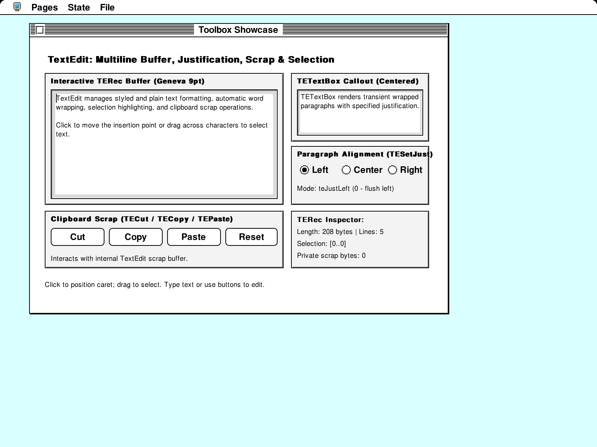
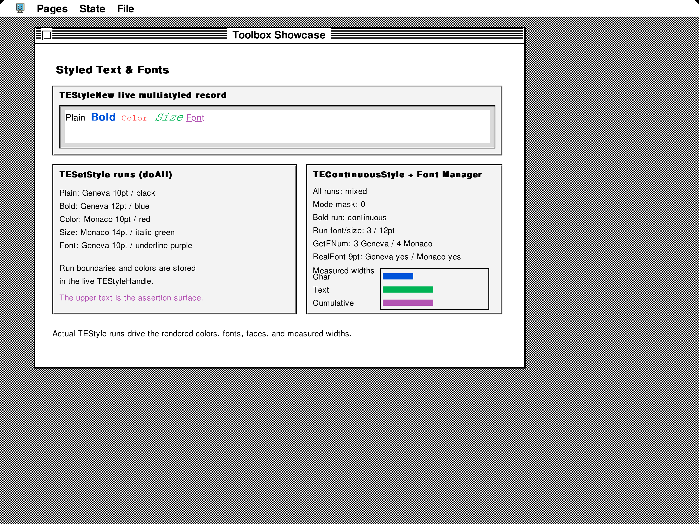
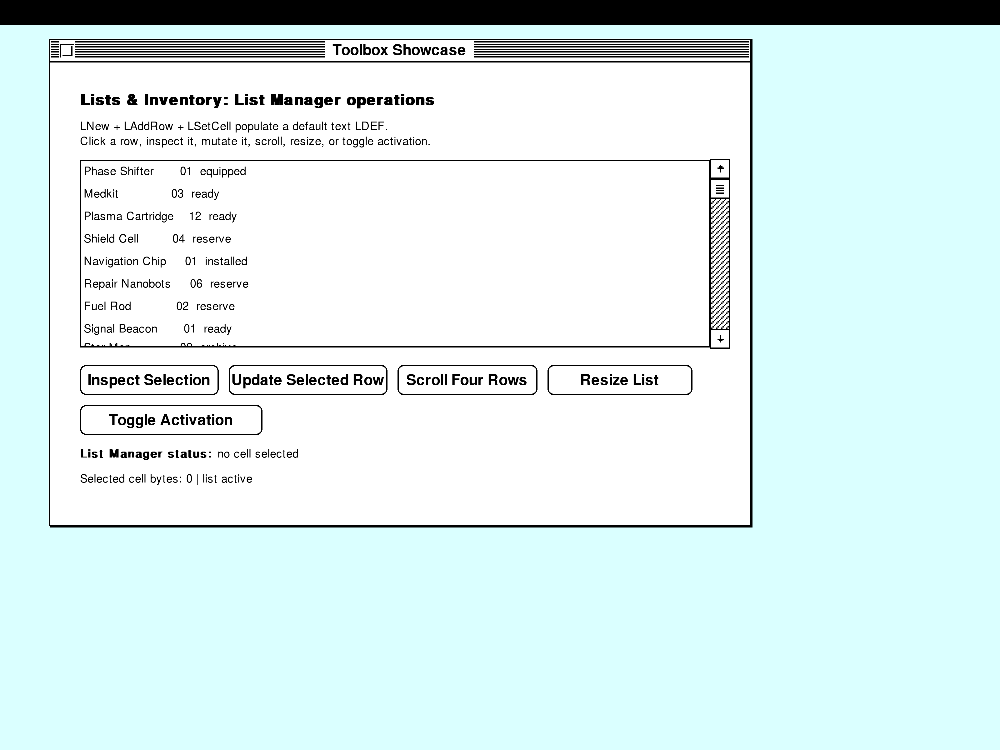
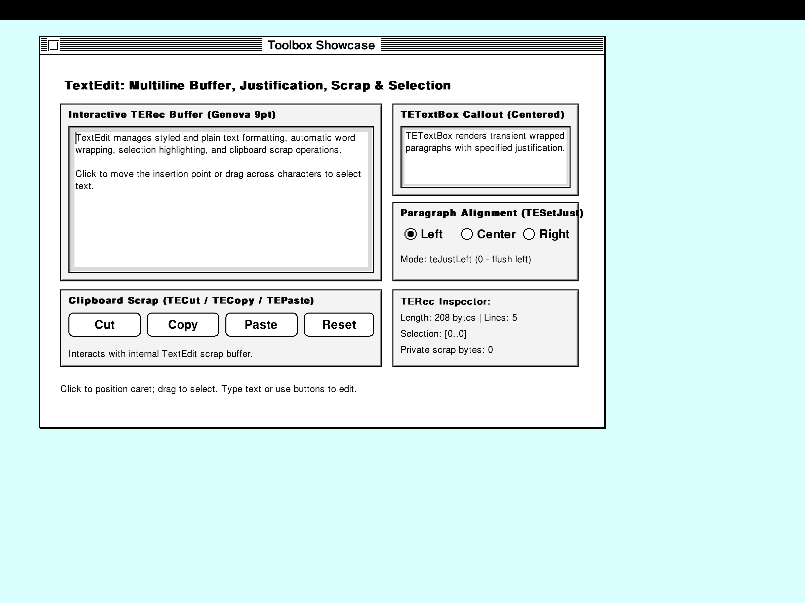
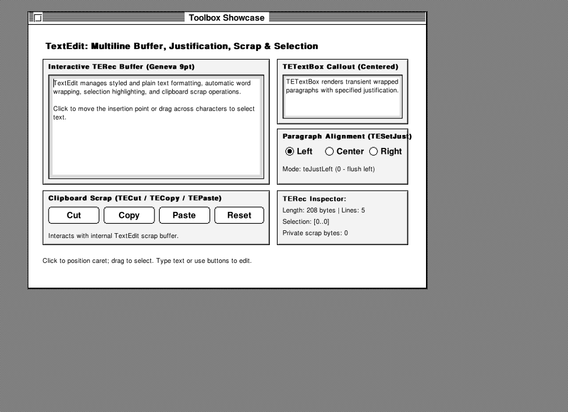

# Outline font Toolbox Showcase

These captures run the actual 68k Toolbox Showcase with the default bundled
TrueType fonts, Classic System 7 theme and a fixed startup clock. The guest
screen remains 800 × 600 at 8-bit depth. The desktop uses the same 4× surface
initialization as the capture test.

| Page | 2× (1600 × 1200) | 4× (3200 × 2400) |
| --- | --- | --- |
| TextEdit | [Open](2x/textedit.png) | [Open](4x/textedit.png) |
| Styled text | [Open](2x/styled-text.png) | [Open](4x/styled-text.png) |
| Drawing | [Open](2x/drawing.png) | [Open](4x/drawing.png) |
| Controls | [Open](2x/controls.png) | [Open](4x/controls.png) |
| Graphics | [Open](2x/graphics.png) | [Open](4x/graphics.png) |




## Reproduce

```sh
./tests/toolbox-showcase/build.sh --verify
SYSTEMLESS_FONT_EVIDENCE_DIR=tests/toolbox-showcase/outline-fonts \
cargo test --no-default-features --test toolbox_showcase \
  capture_outline_font_showcase -- --ignored --nocapture
```

The capture test repeats five pages with presentation disabled, at 2× and at
4×. Every enlarged run must preserve the fresh baseline's guest framebuffer,
execute real outline draws, and differ from nearest-neighbor enlargement.
TextEdit contents, style state and measured-width bars are also checked.
Only the ten lossless gallery PNGs are generated.

The complete interaction test passes separately on both 68k and PowerPC:

```sh
cargo test --no-default-features --test toolbox_showcase test_toolbox_showcase -- --exact
SYSTEMLESS_PREFER_POWERPC=1 cargo test --no-default-features \
  --test toolbox_showcase test_toolbox_showcase -- --exact
```

The [guest-resolution reference gallery](../README.md#reference-screenshots)
was regenerated for both architectures. Changed metrics intentionally affect
wrapping and selection: this TextEdit sample wraps into five lines, and its
fixed mouse drag selects 16 characters. Layout probes sample borders and
backgrounds rather than relying on the old font's ink at a particular pixel.
The archive rebuilt byte-for-byte with the cached pinned toolchain image;
Docker's registry metadata lookup was unavailable.

## First paint after palette changes

The desktop refreshes the display palette between CPU slices. The regression
visits the palette page before opening Lists and TextEdit, then compares their
fresh text pixels with a full repaint after dragging the window. TextEdit is
also checked after inserting and deleting a character. Both comparisons must
be byte-identical. The regression fails against the previous implementation
(`d86e44e6`); [its fresh Lists capture](first-paint/lists-before-fix.png)
reproduces the patchy text. These fixed captures are taken before the drag or typing:




[Lists after dragging](first-paint/lists-after-drag.png) ·
[TextEdit after dragging](first-paint/textedit-after-drag.png)

```sh
SYSTEMLESS_FIRST_PAINT_EVIDENCE_DIR=tests/toolbox-showcase/outline-fonts/first-paint \
cargo test --no-default-features --test toolbox_showcase \
  first_page_outlines_survive_palette_changes -- --exact
```

Palette updates now recolor retained coverage through its original palette
indexes, including antialiased edges and overlapping colors. They no longer
recreate the display from the lower-resolution guest framebuffer.

## Final Mac window scaling

The full 4× captures above precede the GPU's reduction to the window size.
Nearest sampling at that last step dropped thin strokes even when the source
image was correct. The Mac shader now integrates source pixel coverage when
shrinking; enlargement retains nearest sampling.

These images are read back from the actual Metal presentation shader at
960 × 696 pixels, matching an 800 × 580 guest area after hiding the menu bar:

| Previous nearest reduction | Coverage-preserving reduction |
| --- | --- |
| [Open](mac-window/textedit-before.png) | [Open](mac-window/textedit.png) |



The GPU regression checks exact coverage at integral and fractional reductions
and unchanged nearest enlargement. It fails on the previous shader. On macOS:

```sh
cargo test --bin systemless minification_retains_thin_strokes_between_sample_centers
SYSTEMLESS_METAL_FONT_CAPTURE=tests/toolbox-showcase/outline-fonts/mac-window/textedit.png \
cargo test --bin systemless capture_showcase_at_mac_window_size -- --ignored
```

## Rendering scope

Bundled URW and Noto outlines replace the hand-drawn font catalogue. Guest
bitmap/outline resources and explicit local overrides retain precedence.
See [URW provenance](../../../src/quickdraw/fonts/urw/README.md) and
[Noto provenance](../../../src/quickdraw/fonts/noto/README.md).

The 4× desktop surface handles plain, bold, italic and underlined 68k
srcCopy/srcOr text on 8-bit screens, plus shared chrome and outline menu
symbols. The guest's binary framebuffer and text advances remain unchanged
by presentation. Visibility and clipping regions constrain the enlarged ink;
repeated coverage does not darken edges, and opaque text runs preserve
adjacent overhangs. Cursor and debug overlays retain guest coordinates.

Native PowerPC drawing, other pixel depths, remaining styles/transfer modes
and browser output use the logical raster. Bitmap copies, selection inversions
and palette changes can discard extra outline detail until text is redrawn.
Substituted font metrics can also overflow fixed layouts in guest applications;
increasing presentation resolution does not change those layouts.
