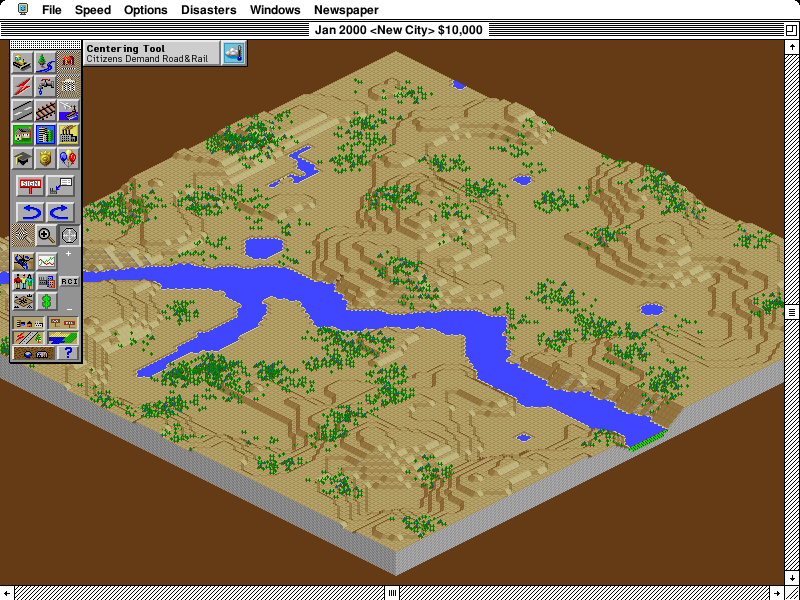

# Coppet Windows validation

Performance/screenshot base: upstream `7438e3391b2a59635ac199626f271d16e5dc88be` (v0.41.8).
Candidate: same base plus the Coppet 9-point ASCII fallback. The font is version 0.024; binary and source hashes are in [build-provenance.json](build-provenance.json).

Before publication, upstream #2005 landed (`392138c4b7d3b974c32747361dd8d480ec9a408e`). The PR was rebased onto it, rebuilt for Windows and rechecked through registration/New City/city at 800×600 and 1104×828. The final library suite passed 5,493 tests (3 ignored); both architecture galleries again passed 4 tests (1 ignored). These supplemental GUI checks were functional checks with compilation/tests running separately in WSL, not new performance samples. The paired measurements below remain on the explicitly recorded 7438e33 base.

## Controlled replay

Native Windows x86_64 GNU release, fat LTO, Ryzen 7 5700U/Radeon laptop. AC power, 99% battery, Balanced scheme, battery saver off throughout. No other Systemless windows, compilation, tests or CPU sampling ran during measurement. Timing records are buffered until the replay ends; normal game diagnostics retain the same configuration in both binaries.

Each size ran master/candidate then candidate/master, 1,100 fixed-clock guest frames per process, with the same input script and instruction budget. The table gives the range of the two run medians, not a confidence interval. Total work is timed directly; it is not a sum of separate phase medians.

| Scene | Output size | Master median, ms | Coppet median, ms |
| --- | --- | ---: | ---: |
| New City | 800×600 | 4.65–4.69 | 4.61–4.61 |
| City | 800×600 | 5.52–5.55 | 5.51–5.88 |
| New City | 1104×828 | 19.70–20.02 | 19.37–19.43 |
| City | 1104×828 | 20.33–20.55 | 19.90–20.65 |

There is no consistent city-frame slowdown across these runs. One native candidate run is slower; its repeat overlaps master. These samples do not establish a speedup or eliminate small regressions. [Full results](replay-results.json) include phase medians, p95s, sample counts and power records.

The replay measures guest CPU work, compositing, retained text presentation and final resizing. It excludes GUI surface work, host audio mixing, pacing, physical scanout and cold font loading. Every measured stage has identical guest tick/instruction rows across variants. One warmup frame (73) has 65 additional guest instructions with Coppet; subsequent rows match. Guest text pixels intentionally differ, so this is not a claim of framebuffer/RAM identity.

## Live GUI

The native Windows GUI was launched separately for master and Coppet. Each run navigated registration, New City and the city view, resized to both output sizes, and recorded 15-second samples after settling. The city view includes the originally reported “Power Plant Needed” status text. Screenshots were inspected; the windows closed normally.

| Scene/output | Master median frame work, ms | Coppet median frame work, ms |
| --- | ---: | ---: |
| new-city-native | 7.14 | 6.75 |
| new-city-scaled | 20.92 | 21.00 |
| city-native | 7.72 | 7.49 |
| city-scaled | 20.61 | 20.64 |

These live runs include guest CPU/audio, composition, retained presentation, software surface acquisition and submission. They are one run per build with live guest scheduling, not a matched-frame latency experiment. Physical display/input latency was not measured. [Master phase results](gui-master-results.json) and [Coppet phase results](gui-candidate-results.json) give counts, medians and p95s. Their phase medians must not be added together to estimate a total.

AC power, 99% battery, Balanced mode and battery saver off were recorded before and after both runs. No builds, tests, CPU profiling or other Systemless windows overlapped. Timing records were buffered and written when each window closed.

Live city captures with “Power Plant Needed”: [master native](gui-city-before-800x600.png), [Coppet native](gui-city-after-800x600.png), [master 138%](gui-city-before-1104x828.png), [Coppet 138%](gui-city-after-1104x828.png).

## Screenshots

The city comparisons below are fixed-clock replay frame 999. They show the same terrain and UI state; the status line reads “Citizens Demand Road&Rail.” Dialog images use frame 499. Live GUI screenshots were inspected separately because their terrain and guest timing are not identical across runs.

Master: existing Nimbus Sans fallback — Native, 800×600.

Coppet: fitted 9-point fallback — Native, 800×600.

Master: existing Nimbus Sans fallback — 138%, 1104×828.

Coppet: fitted 9-point fallback — 138%, 1104×828.

New City screenshots: [before native](new-city-before-800x600.png), [after native](new-city-after-800x600.png), [before 138%](new-city-before-1104x828.png), [after 138%](new-city-after-1104x828.png).

## Compatibility checks

- 5,493 library tests passed on the final rebased branch; 3 ignored (5,492 passed on the performance base). The focused font subset passed all 25 tests.
- Toolbox Showcase with reference and 4× review-gallery checks: 4 passed, 1 ignored on both 68k and PowerPC. Intentional 9-point artwork changes affect 45 captures per architecture/resolution; all 180 refreshed PNGs have actual changed pixels, not just different encoding ([pixel-change report](reference-pixel-diff.csv)).
- Semantic checks retain layout measurements, clipping, selection, typing/caret behavior, offscreen copies, palette changes and repainting. Other sizes/families and extended Mac Roman artwork stay unchanged in font tests.
- The editable TTX and pinned hinting recipe rebuild the shipped font byte for byte. Its glyph, metric and hint tables match the approved comparison font.

## Reproduction

Run `cargo test --locked --lib --no-default-features --features jit`. For the showcase, run `SYSTEMLESS_VERIFY_REVIEW_GALLERY=1 cargo test --locked --profile ci-test --no-default-features --features jit --test toolbox_showcase`, and repeat with `SYSTEMLESS_PREFER_POWERPC=1`. Build Windows with `cargo build --locked --release --target x86_64-pc-windows-gnu` and the configured MinGW linker.

The local performance diagnostic links each corresponding release library and replays SC2K through `run_gui_cpu_slice` with a fixed clock, 415,628 instructions/tick and 1,100 frames. The timing scripts and replay source are preserved alongside this validation locally; the copyrighted game archive is not included.
