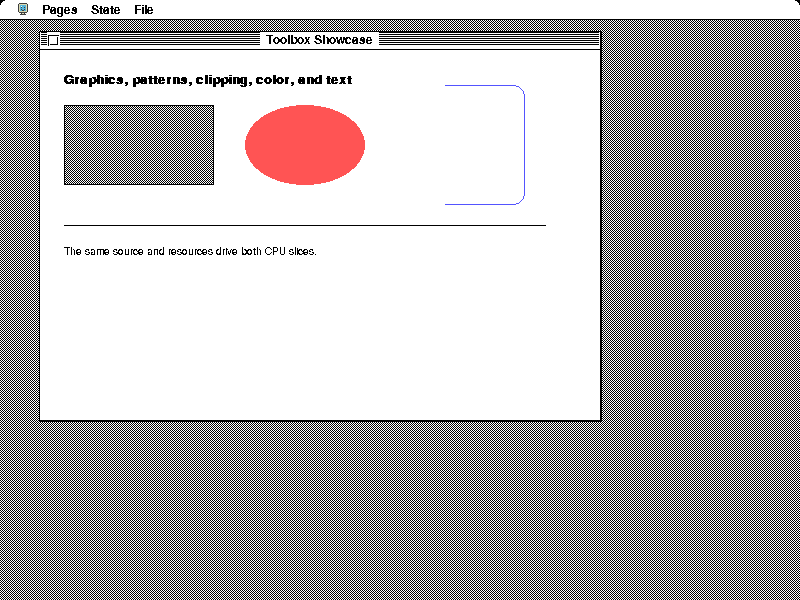
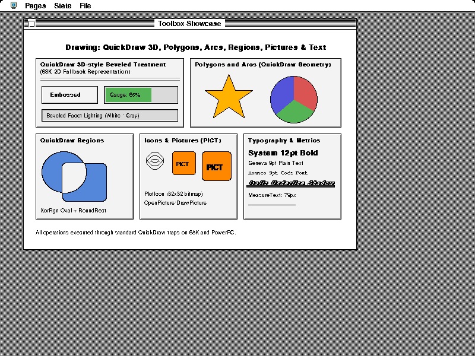
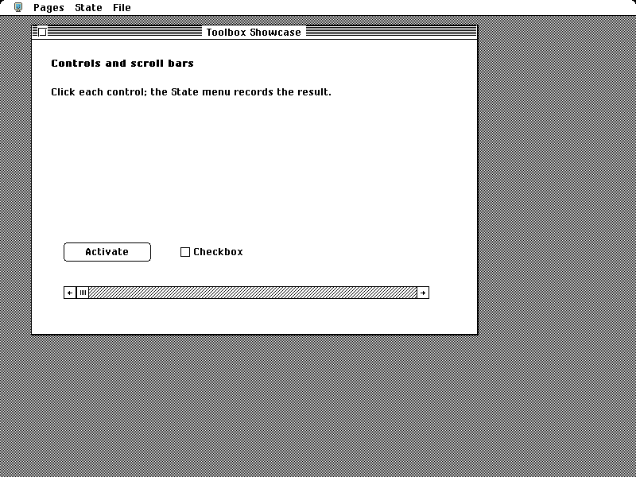
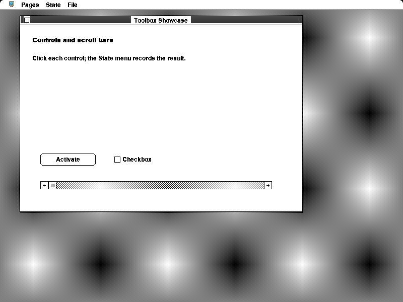
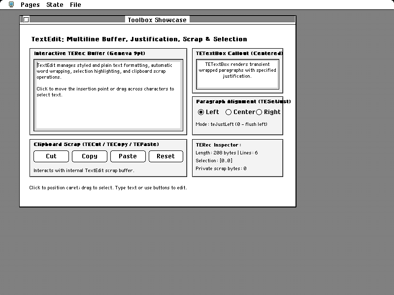
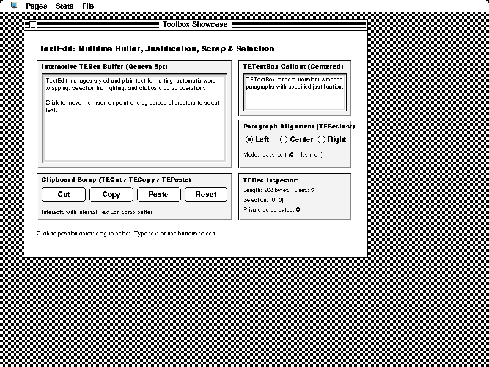
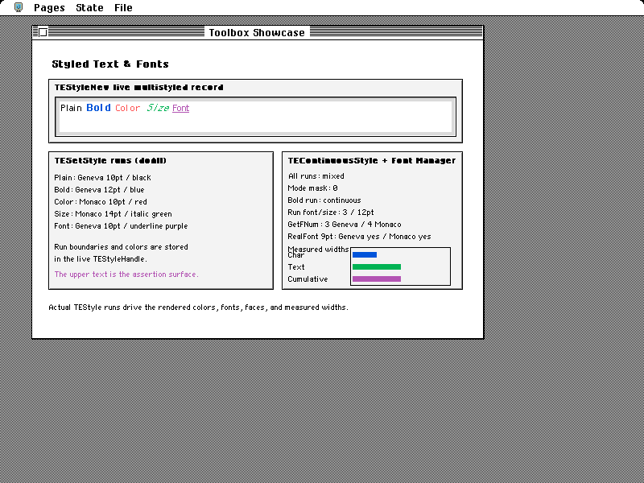
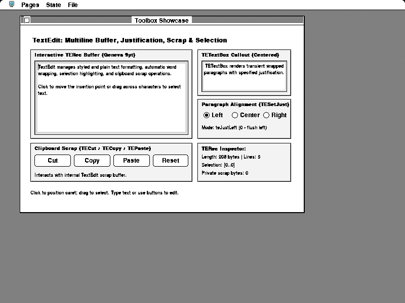
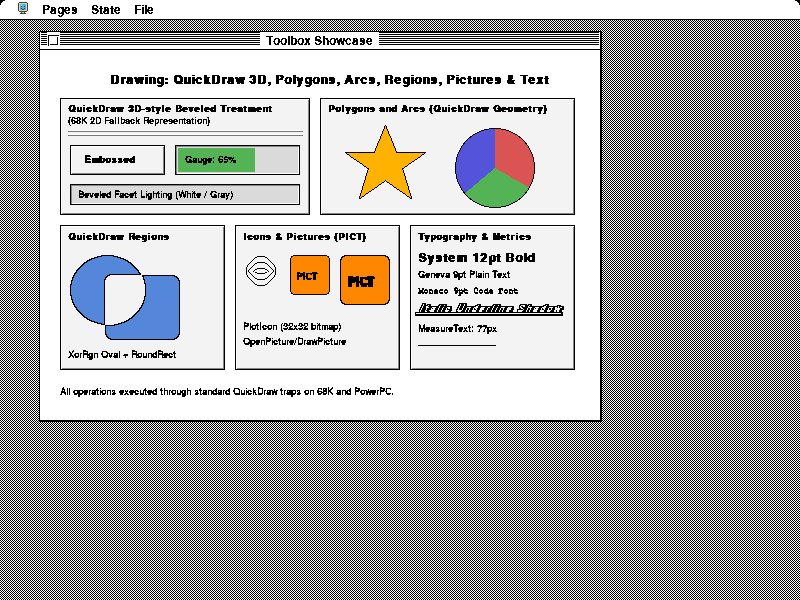
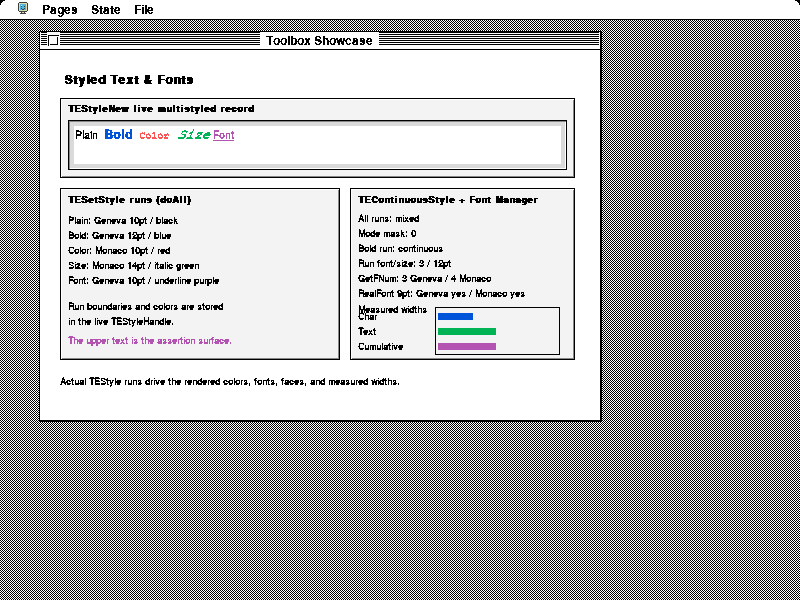

# Experimental URW fallback: Toolbox Showcase

This experiment addresses [#673](https://github.com/benletchford/systemless/issues/673)
without changing the default renderer. These are screenshots from the real
Toolbox Showcase guest application, using Classic System 7 chrome, a fixed
startup clock, the 68K executable, and an 800 × 600, 8-bit screen. Both runs use
the same fixture and capture routine. Images are unmodified framebuffer exports.

## Higher-resolution direction

Both one-bit URW versions failed visual review. The next experiment is an
[isolated 1×/2×/3× text proof](resolution/README.md) using the same logical
spacing and freshly rasterized outlines at higher physical resolution. It also
preserves grayscale edge coverage. This specimen is not a guest screenshot or
a completed high-resolution display backend. The captures below remain evidence
of the low-resolution runtime's current output, not visual acceptance.

| Page | Default bitmap fallback | Experimental URW fallback |
| --- | --- | --- |
| Graphics |  |  |
| Drawing and typography |  |  |
| Controls |  |  |
| TextEdit |  |  |
| Styled text and measurements |  |  |

## Monochrome correction (still not visually accepted)

The initial URW experiment used Swash 0.2.10, whose hinting configuration uses
LCD smoothing with `preserve_linear_metrics: true`. Thresholding those outlines
to one-bit pixels loses fractional strokes. Expanding the outlines to recover
those strokes made the small text heavy and cramped. That version failed visual
review; its narrower wrapping was not evidence of better typography.

The corrected renderer uses Skrifa's `Target::Mono` to grid-fit both axes for
one-bit output, uses the hinter's adjusted advances, and passes the resulting
outlines to Zeno. All family-specific ink expansion is removed. The TTF files,
family mapping, logical point sizes, and QuickDraw style synthesis are unchanged.
The screenshots isolate that rendering correction.

| Rejected LCD hinting + ink expansion | Corrected monochrome grid fitting |
| --- | --- |
|  |  |
|  |  |
|  |  |

Inspect the 9-point body text and the 10-point styled-text legend: the corrected
renderer has clean individual stems and open counters without the artificial
weight. The original rejected images are from public commit
[`6ebb85490`](https://github.com/benletchford/systemless/commit/6ebb85490).

## What the comparison establishes

The default bitmap baseline is public `master` commit
[`e2772dfd4a7fc8890c69bffeea6f9991f21427ae`](https://github.com/benletchford/systemless/commit/e2772dfd4a7fc8890c69bffeea6f9991f21427ae)
with the same capture helper added.

- The drawing sample measures 79 pixels with monochrome grid fitting, 77 in
  the rejected renderer, and 82 with the default bitmaps. This documents the
  effect of adjusted advances; it is not an appearance score.
- The 208-byte TextEdit buffer remains five lines in both URW runs (six in the
  bitmap baseline). The improvement here is the stroke rendering.
- Font regressions check uninterrupted H stems, open o counters, and baseline
  placement at 9–12 points in the sans and monospaced families. The other font
  tests cover exact requested sizes, binary masks, Mac Roman, and resource
  precedence.

Substitute letterforms and spacing still differ from classic Mac fonts. Core 35
provides no exact Chicago, Geneva, Monaco, London, or Cairo designs. This remains
an experimental fallback and does not constitute native-Mac pixel approval.

## Acceptance limits

The default library tests pass. The experimental font-contract tests and both
showcase capture runs pass, but the full library suite with the feature enabled
still exposes classic menu/pixel/spacing assumptions. Those checks have not been
weakened or had their expected pixels updated. Three tests of bitmap-specific
family substitution/scaling remain enabled only for the default backend.

Validation on the final experimental renderer:

| Check | Result |
| --- | --- |
| Default library suite (unchanged baseline validation) | 5,117 passed; 3 ignored |
| Default font contracts, rerun for this correction | 24 passed |
| Experimental font contracts (`--features experimental-urw-fonts --lib quickdraw::fonts`) | 26 passed |
| Full experimental library suite | 5,112 passed; 7 failed; 3 ignored |
| Showcase captures: 68K before/after and PowerPC after | Passed |
| `wasm32-unknown-unknown` check with the experimental feature | Passed |
| Package file inventory | All eight fonts, source record, and OFL notices included; screenshots excluded |

Remaining failures with the experimental feature:

```
loader::ppc::tests::menu_bar_title_baseline_tracks_the_live_menu_bar_height
loader::ppc::tests::short_menu_bar_system_mark_does_not_bleed_below_the_bar
menu_manager::tests::standard_menu_text_measurement_is_shared_between_gateways
trap::framebuffer::redraw_chrome_tests::menu_bar_title_baseline_tracks_live_height
trap::framebuffer::redraw_chrome_tests::redraw_chrome_places_live_popup_over_the_kiosk_stage
trap::menu::tests::systemless_theme_does_not_change_popupmenuselect_geometry_and_result
trap::quickdraw::tests::stringwidth_scales_monotonically_with_textsize
```

Before enabling this by default, resolve the menu-mark placement, popup geometry,
and size-scaling failures; review small sizes, reverse video, and application
layouts against a broader native reference set. This does not add guest Font
Manager trap support or change `RealFont`'s existing availability rules. The
prototype therefore references #673 without closing it.

## Reproduce

Run from a checkout of the public systemless repository. Leave
`SYSTEMLESS_ORIGINAL_FONTS_DIR` and `SYSTEMLESS_PREFER_POWERPC` unset for this
68K comparison. These commands write evidence only; they do not accept or
replace the main regression suite's reference images.

```sh
SYSTEMLESS_FONT_EVIDENCE_DIR=tests/toolbox-showcase/urw-experiment/before \
  cargo test --no-default-features --test toolbox_showcase \
  capture_urw_font_experiment -- --ignored
SYSTEMLESS_FONT_EVIDENCE_DIR=tests/toolbox-showcase/urw-experiment/after \
  cargo test --no-default-features --features experimental-urw-fonts \
  --test toolbox_showcase capture_urw_font_experiment -- --ignored
```

The capture waits for each selected page to return to the guest event loop.
It also checks live TextEdit content, colored style runs, and rendered
CharWidth/TextWidth/MeasureText bars. Successful execution proves that these
pages render and their semantic probes pass; it does not establish pixel or
metric equivalence to classic fonts.

The optional backend uses unmodified OFL-licensed URW fonts, Skrifa monochrome
hinting, and Zeno rasterization. The matching hinted advances are used for both
measurement and drawing. The guest sfnt renderer is unchanged. See
[source and license details](../../../src/quickdraw/fonts/urw/README.md).
