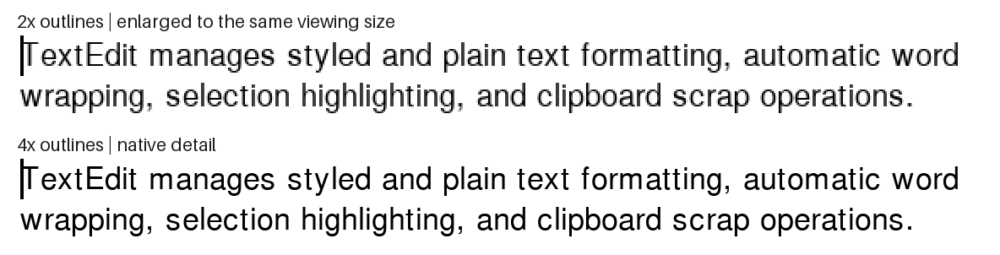

# Real Toolbox Showcase: 2× versus 4× outlines

4× gives small curves and diagonals more detail, especially when zoomed. It has
four times as many presentation pixels as 2×, so it also costs more memory and
rendering work. At a normal 2× display size the difference is subtler.

Both resolutions below use the same updated compositor. The guest screen stays
800 × 600; only the presentation plane becomes 1600 × 1200 or 3200 × 2400.



The comparison crops the same logical rectangle `(74, 126)..(360, 150)` from
both real TextEdit captures. The top enlarges the 2× pixels with nearest-neighbor
sampling; the bottom shows native 4× pixels. This is a zoomed detail comparison,
not a claim that ordinary 2× displays acquire twice as many physical pixels.

For a normal-size comparison, open [native 2×](2x/textedit.png) and
[4× reduced to 2× using box averaging](textedit-4x-at-2x.png). No sharpening or
contrast adjustment was applied. Full-resolution captures follow.

| Page | Updated 2× | Updated 4× |
| --- | --- | --- |
| TextEdit | [2×](2x/textedit.png) | [4×](4x/textedit.png) |
| Drawing | [2×](2x/drawing.png) | [4×](4x/drawing.png) |
| Controls | [2×](2x/controls.png) | [4×](4x/controls.png) |
| Graphics | [2×](2x/graphics.png) | [4×](4x/graphics.png) |
| Styled text | [2×](2x/styled-text.png) | [4×](4x/styled-text.png) |

## Compositing corrections

Repeated drawing previously blended partial glyph coverage over its own ink,
progressively darkening edges. The plane now retains same-color coverage so
repainting the same glyph is idempotent. An ordinary framebuffer write still
invalidates that coverage, even when the guest byte does not change.

Opaque character-by-character drawing could also erase an earlier character's
native overhang. DrawString, DrawText, and StdText now mark the bounds of an
opaque text run: background erases preserve ink already drawn within that run,
but a new run clears that protection. This does not preserve old text when a
replacement string is drawn. Guest memory writes remain unchanged.

These bugs reproduce in focused tests, but neither was triggered by these five
showcase captures: the updated 2× screenshots are pixel-identical to the prior
2× screenshots. The visible improvement here is therefore attributable to 4×
rasterization, not these compositing corrections. They do not complete retained offscreen rendering, scrolling/CopyBits, selection,
XOR, other pixel depths/CPUs, or italic/underline/outline/shadow combinations.
Those paths can still exhibit the old rendering. Layout overflow caused by the
substitute font's existing logical metrics also remains outside this change.

## Validation and reproduction

- Both real five-page captures pass. Every underlying guest framebuffer matches
  the preceding 1× monochrome capture pixel for pixel.
- All 351 memory-filtered tests pass, including five focused presentation tests.
  New assertions cover repeated coverage, adjacent-character erasure versus a
  new text run, and 4× dimensions.
- The experimental WebAssembly build passes. The earlier full-suite results and
  seven experimental font-metric/menu failures remain recorded in the
  [2× experiment](../presentation/README.md); that full suite was not repeated
  for this capture revision.

From the public repository, run each scale into a separate output directory:

```sh
SYSTEMLESS_FONT_EVIDENCE_DIR=/tmp/toolbox-4x \
SYSTEMLESS_FONT_PRESENTATION_SCALE=4 \
cargo test --no-default-features --features experimental-urw-fonts \
  --test toolbox_showcase capture_urw_font_experiment -- --ignored --nocapture
```

Repeat with scale `2` for the comparison. The `native-*.png` files are the
presentation exports; unprefixed files are untouched guest pixels. Published
PNGs were losslessly compressed with decoded pixels verified unchanged.
