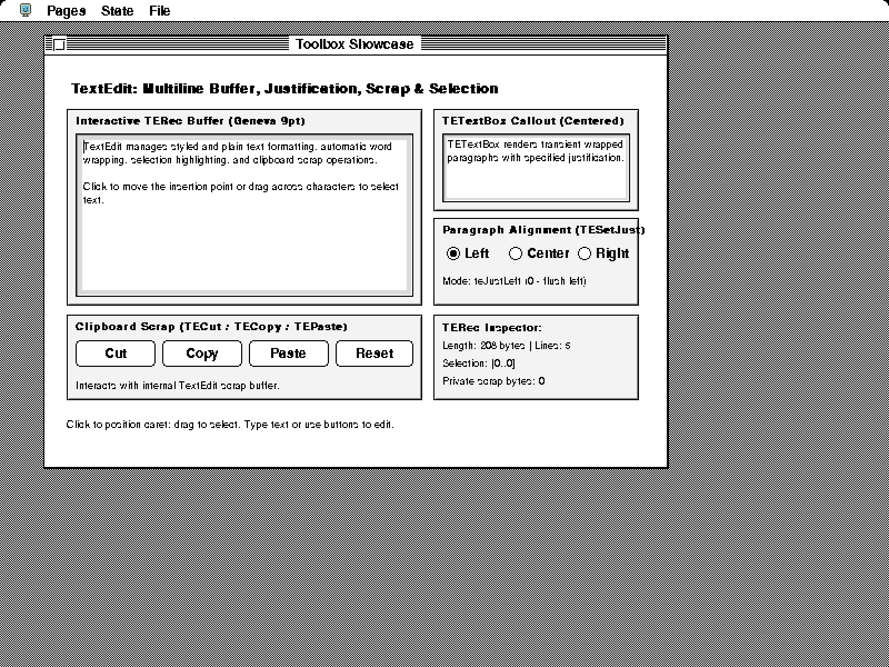
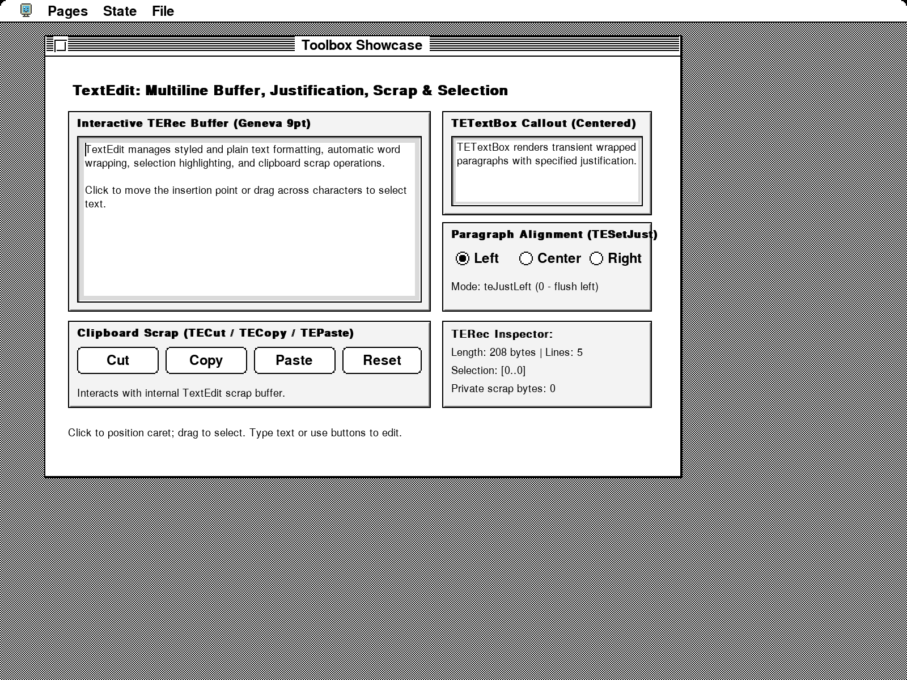
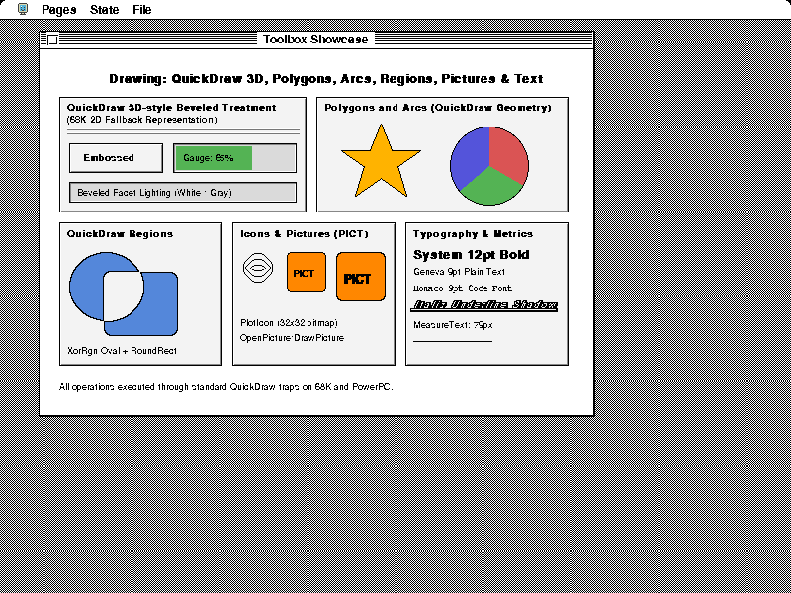
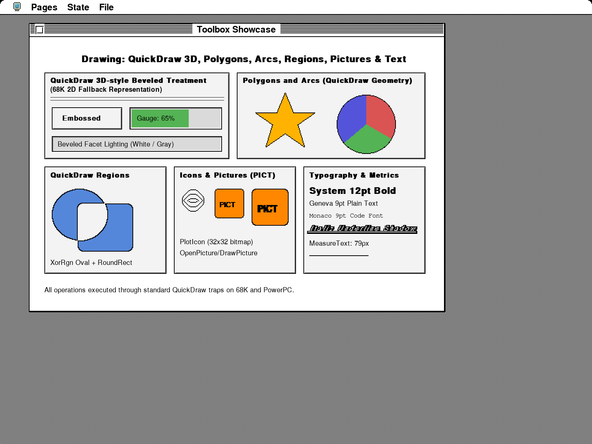
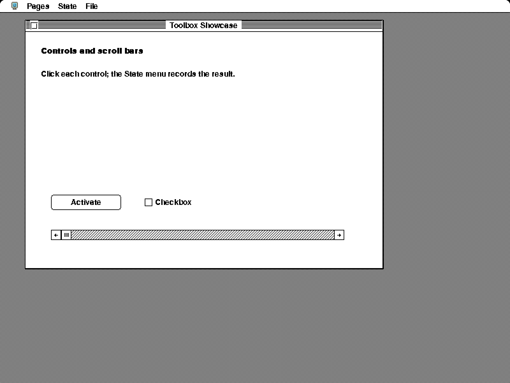
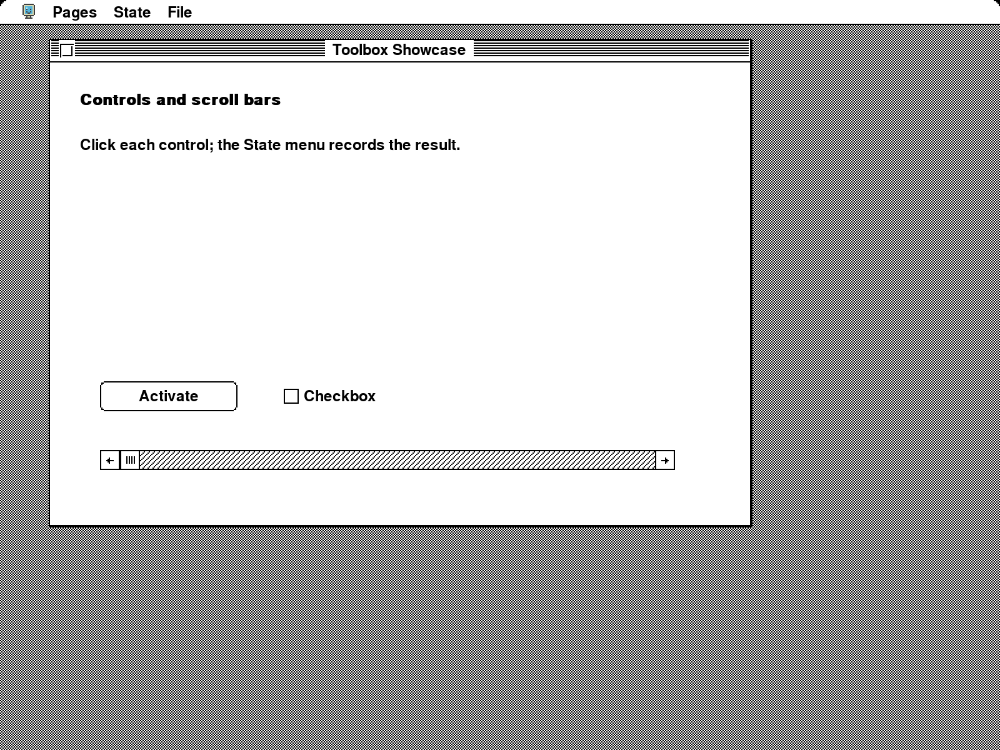
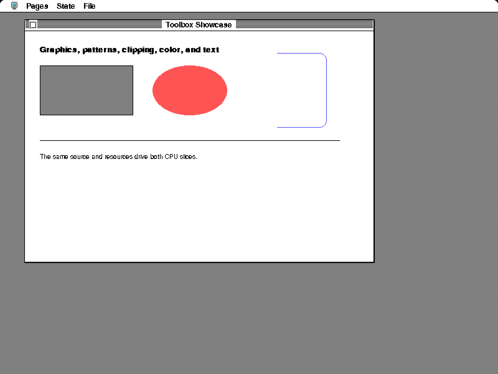
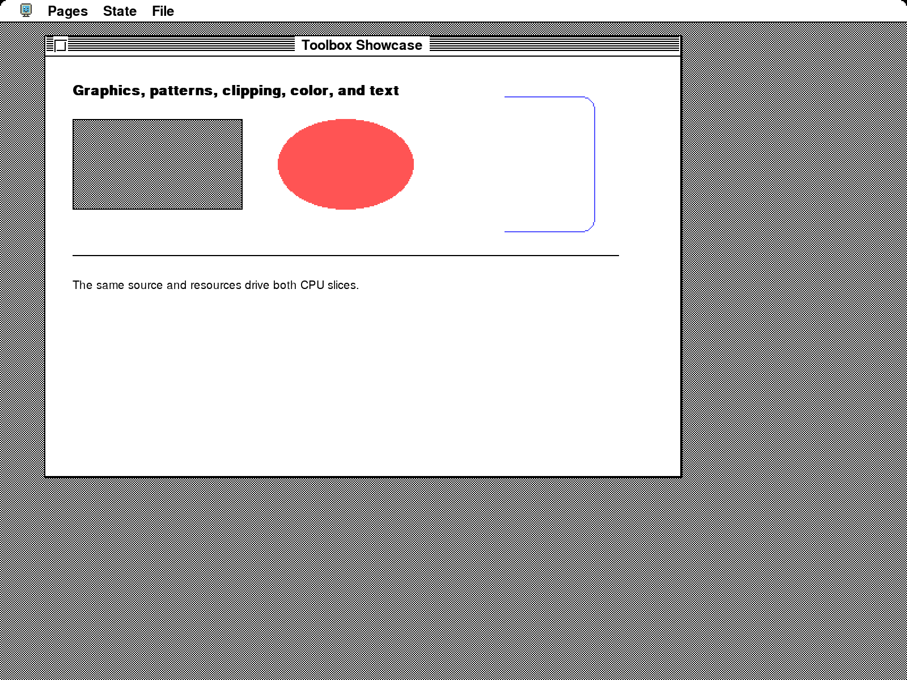
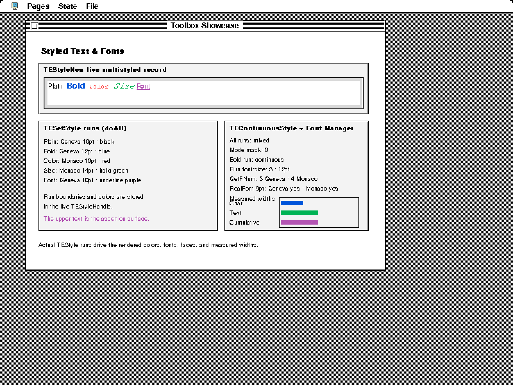

# Real Toolbox Showcase at 2× text resolution

For the updated compositor and 4× comparison, see the [latest captures](../presentation-4x/README.md). The images here record the initial 2× revision.

These captures come from the running 68k Toolbox Showcase, with its original
800 × 600, 8-bit guest framebuffer. The experimental presentation plane produces
1600 × 1200 RGB images. The guest executes its own drawing, TextEdit, menus, and
controls; no labels or window contents are reconstructed from the fixture source.

Compare at the same displayed size. Open an image to inspect its full resolution.

| Page | Enlarged guest pixels | Fresh 2× text outlines |
| --- | --- | --- |
| TextEdit |  |  |
| Drawing |  |  |
| Controls |  |  |
| Graphics |  |  |
| Styled text |  |  |

## What is implemented

Supported URW glyphs are rasterized from their outlines at the physical size,
using Skrifa grayscale hinting and Zeno coverage. Logical advances, baselines,
line wrapping, hit testing, and the guest framebuffer remain unchanged. Plain
and bold 68k text in srcCopy/srcOr modes is supported, together with the shared
8-bit chrome glyph painter. Bold keeps the existing one-logical-pixel smear,
applied to the higher-resolution mask.

The presentation plane starts from the actual framebuffer. Ordinary writes
replace the affected enlarged pixels, including same-value writes. Supported
glyph writes update guest memory normally while coverage blends over the
presentation background. The QuickDraw path submits only cells surviving the
existing visibility and clipping regions. This preserves drawing order without
leaving enlarged binary letters underneath the new outlines.

## Evidence and limits

The capture test verifies all five 1× guest exports against the preceding
monochrome captures, pixel for pixel. It also requires native outline draws and
checks that each 2× result differs from simply enlarging the guest framebuffer.
Existing live TextEdit and styled-text assertions still run. The focused tests
cover clipped coverage, alpha blending, later same-value writes, wide and bulk
writes, overlapping copies, and unchanged logical font advances.

This is an opt-in capture prototype, not a completed desktop/browser high-DPI
backend. The palette and screen format are fixed when capture starts. Unsupported
styles (including italic/underline/outline/shadow combinations), transfer modes,
resource fonts, and bitmap content retain their existing appearance. The styled
text and drawing pages intentionally expose those differences. Copies and
scrolls use guest pixels and therefore lose high-resolution detail until text is
redrawn; selection/XOR and retained offscreen/window surfaces need further work.
PowerPC and other pixel depths are not enabled by this capture path. No default
font or display behavior changes.

## Reproduce

From this repository:

```sh
SYSTEMLESS_FONT_EVIDENCE_DIR=tests/toolbox-showcase/urw-experiment/presentation \
SYSTEMLESS_FONT_PRESENTATION_SCALE=2 \
cargo test --no-default-features --features experimental-urw-fonts \
  --test toolbox_showcase capture_urw_font_experiment -- --ignored --nocapture
```

The scale can also be set to 3 or 4 and a separate output directory chosen. Files
without a prefix are the untouched 1× guest exports; `enlarged-` uses nearest
pixel enlargement; `native-` exports the parallel presentation plane.

Validation for this capture revision: 5,117 default library tests passed (3
ignored); 5,115 experimental library tests passed, with the same 7 pre-existing
experimental font-metric/menu failures (3 ignored). After the final glyph-bound
adjustment, all 349 memory-filtered tests and the five-page capture passed. The
experimental WebAssembly build passed. PNGs were losslessly recompressed after
capture, with decoded pixels verified unchanged.
