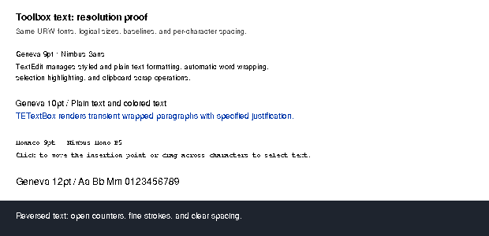
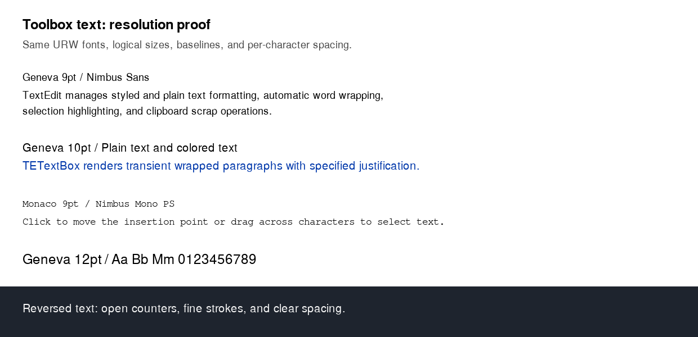
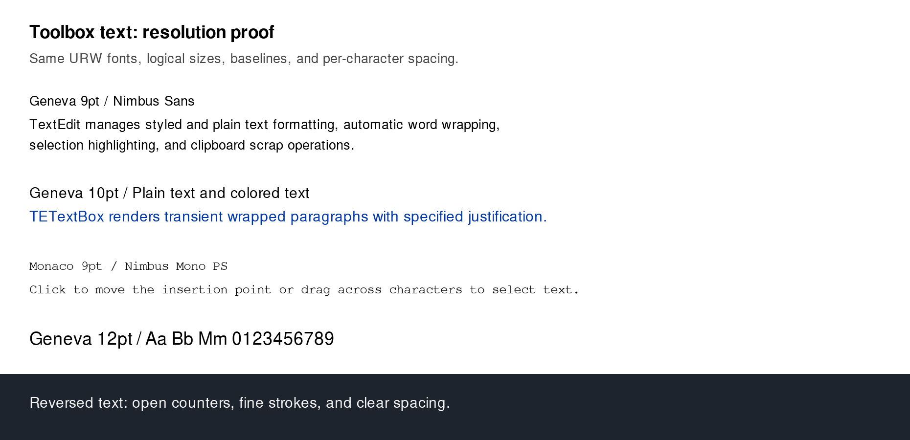

# Higher-resolution URW text proof

This is an isolated font specimen using the Toolbox Showcase's strings and
9/10/12-point font sizes. **It is not a guest framebuffer capture, and it is not
yet integrated into the emulator's display.** The current low-resolution URW
renderer has not passed visual acceptance.

The proof keeps the same URW files, logical coordinates, baselines, and
per-character advances. At 2× and 3×, it rasterizes outlines at twice or three
times the point size into the corresponding physical pixel buffer, preserving
grayscale coverage. The existing guest bitmap is enlarged with nearest-neighbor
sampling for comparison. A 1× antialiased control is also included, so the effects
of antialiasing and additional resolution can be inspected separately.

The specimens contain sans text, the system font, monospaced text, blue text,
and reversed text. They do not exercise QuickDraw synthetic styles, clipping,
scrolling, transfer modes, or overlapping windows.

## Compare at the same logical size

Each image below is shown at 620 logical pixels wide. A 2× display can show the
second image's native detail at this size. Open the images at 100% to inspect
the physical pixels; larger images displayed at 100% also make the text larger.

### Current one-bit glyphs



### Fresh 2× outlines with grayscale coverage



### Fresh 3× outlines with grayscale coverage



[Equal-physical-size 2× comparison](comparison-2x.png) ·
[Equal-physical-size 3× comparison](comparison-3x.png) ·
[1× antialiased control](text-1x-aa.png)

The combined comparisons put the enlarged 1× bitmap above the fresh outlines.
The example asserts that fresh rendering differs from enlarging either the
binary bitmap or the 1× antialiased control.

## Reproduce

From the public systemless checkout:

```sh
cargo run --no-default-features --features experimental-urw-fonts \
  --example urw_resolution -- tests/toolbox-showcase/urw-experiment/resolution
```

The standalone example uses the production fallback's advances for every logical
pen position and Skrifa/Zeno for high-resolution outlines. It applies ordinary
grayscale coverage blending to the specimen's RGB background. It does not model
the guest display palette or gamma.

## Runtime integration still required

A display implementation must keep guest memory and logical layout unchanged,
while maintaining a separate presentation surface at the host pixel density.
It must retain or replay text with correct backgrounds, clipping and draw order;
painting sharp text over existing enlarged glyphs would leave visible remnants.
Scrolling, CopyBits, direct guest framebuffer writes, selection and XOR drawing
must update or invalidate that presentation data correctly. Both CPU paths,
window chrome, and browser/desktop output need to participate.

This proof evaluates appearance before taking on that integration. It does not
change the existing seven compatibility failures in the one-bit experiment.
