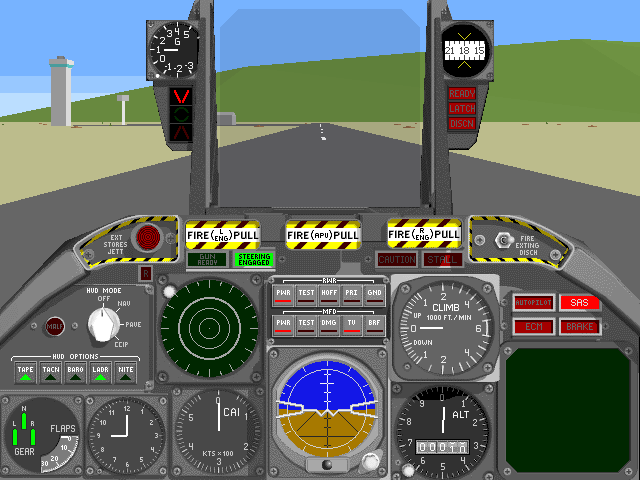

## In the cockpit

Parsoft's flight simulation starts with two Quick Start missions: an unopposed
flight over Demo Island and a combat scenario. In the cockpit you can start the
engines, manage the aircraft's systems, and take off from the island runway.

## The original timed demo

This is the original Macintosh demonstration, not the full commercial game.
The bundled Read Me limits each mission to five minutes and describes the two
demo missions. The catalogue does not include a time-limit-removal patch.
