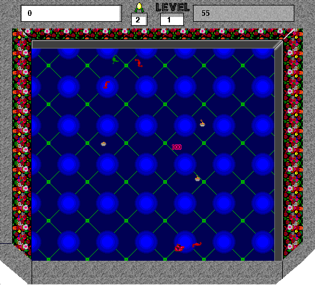

## Collect the sugar worms

Dismiss the registration reminder with **Not Yet**, then select **Play** to
enter Level 1. Collect the bowls of sugar worms while avoiding the creatures.
The game's **Instructions** menu explains its characters and pickups.

Use **Keypad 8**, **Keypad 2**, **Keypad 4**, and **Keypad 6** to move; **Keypad 5** stops Glerp.
