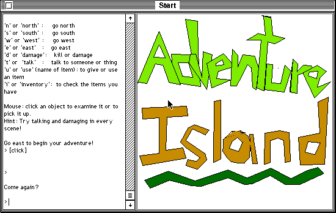

## A text adventure after the shipwreck

Adventure Island casts the player as a survivor of a hurricane, washed toward a
mysterious island. The compact 68k text adventure accepts directional and
object commands, with mouse input available for examining or collecting things.

## Preserved under the ReadMe's distribution permission

The bundled ReadMe says: “Go ahead and put it on download sites or CD roms or
whatever, but please don't alter anything.” This entry points to the exact
unchanged 131,259-byte archive and keeps its application and ReadMe together.

## Live command parsing

Systemless reaches the text-adventure window from the exact archive. A
deterministic run clicked the command area, entered `n`, pressed Return, and
received the in-game response `You can't go that way.` This verifies input
processing beyond launch or a static title screen. See [issue #2321](https://github.com/benletchford/systemless/issues/2321)
for the reproducibility record.
