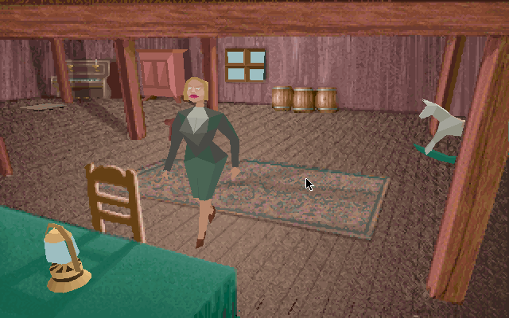

## Inside Derceto

Enter the mansion and explore its rooms in this original Macintosh demo. The
archive contains the promotional edition and its reduced data folder, not the
retail CD or a DOS release.

Choose a screen size at startup. Escape skips the long opening sequences. In
the first room, Left and Right turn the character, and Up moves forward.
Browser launch remains disabled until the promoted archive is tested on the
site.
