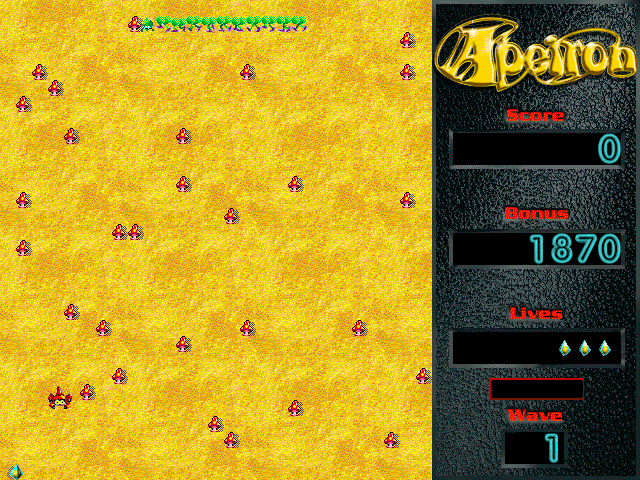

## A garden that fights back

Apeiron turns a familiar arcade idea into a noisy, colourful contest with a
garden full of moving targets. Protect your crystal, shoot through mushrooms,
and gather power-ups while the Pentipede and its companions close in.

This is Ambrosia's original Macintosh shareware release, not a registered or
unlocked copy. On first launch, select **Install**; Systemless then opens the
installed game. Choose **Not Yet** at the registration notice to try it, then
**Play Apeiron**. Ambrosia's included license limits unregistered use to 30
days from receipt. If you want to keep using Apeiron after that period, its
license requires registration.
