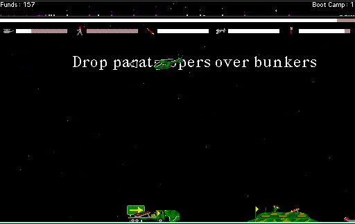

## Battle 1

Armor Alley combines helicopter action with the problem of moving ground
forces across a scrolling battlefield. You fly above tanks, troops and bunkers
while spending limited funds to support a convoy toward the opposing base.

This is the original Macintosh demonstration, not the retail game. Its own
notice restricts play to Battle 1 and removes additional helicopters and
funds. The catalogue keeps its promotional StuffIt archive byte-for-byte.
Systemless reaches the practice battle, and a matched no-input run confirms
that keyboard input changes the live battle state.
