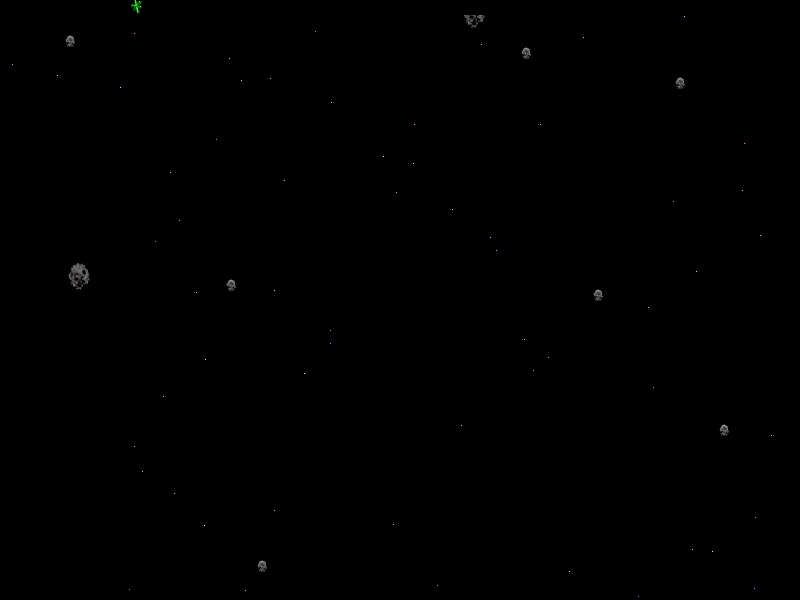

## Source and version

This entry uses the unchanged Asterax 1.0.1 StuffIt archive. The bundled README
and all standard application files remain together so the archive preserves the
author's non-profit distribution condition.

## In the asteroid field

Asterax begins with a ship-selection screen and opens into a fast asteroid field
where pilots mine emeraldium while avoiding rival ships and hazards. The original
Player One controls are KP8 for thrust, KP6 and KP4 for turning, and Control for
fire. A deterministic Systemless run selected a ship, entered the asteroid field,
and verified visible state changes after fire, thrust and turn input.

## Distribution condition

Arvandor Software's bundled README grants free distribution only when the README
and all standard application files are included. Distribution for profit requires
the author's consent; this catalogue entry therefore describes non-profit use and
does not grant commercial redistribution rights.
