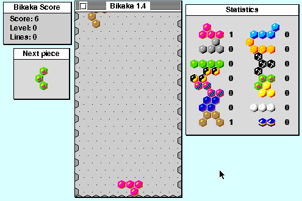

## Arrange falling hexagons

The game starts as soon as it opens. Move the falling piece with **M** and
**-**, rotate it with **,** and **.**, and press **Space** to drop it. Choose
**Configure keys** from the **File** menu to change the controls.
