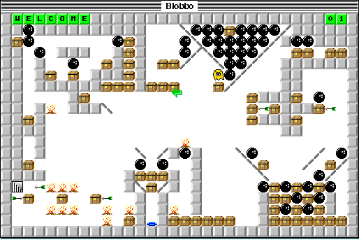

## Twenty-five levels to solve

Guide the yellow Blobbo through each room with the arrow keys. The goal is to
collect the toys while avoiding traps. This Lite version includes all 25 levels
and supports saving and restoring a game. The registered version adds a level
editor and solution recording.
