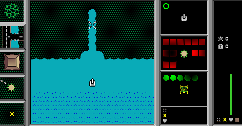

## The official 0.99.7 package

This is Stuart Cheshire's complete electronic distribution: Bolo itself, its
sound file, the Standard Autopilot brain and the manuals and technical notes that
travelled with the game. It remains in the original BinHex wrapper submitted to
Info-Mac. The bundled shareware notice permits free, noncommercial electronic
redistribution of this complete, unmodified package; it asks players to pay
the shareware fee after a one-month evaluation. No registered copy or key is
included.

## Tank country

Bolo's islands are working landscapes rather than fixed arenas. A tank can cut
through forest, lay roads, repair bridges, place mines and move pillboxes while
trying to capture refuelling bases. Limited sight makes every patch of trees a
possible ambush, and the alliance system leaves room for cooperation, betrayal
and long territorial campaigns.

The included tutorial teaches the terrain and construction tools without a
network. The larger game was made for groups: up to sixteen commanders sharing a
map, with optional programmable “brains” assisting their tanks.

Systemless currently reaches the local Tutorial, paints its water and terrain,
and responds to the boat's forward control. Browser launch remains disabled
until the released runtime and hosted assets pass an in-browser check.
