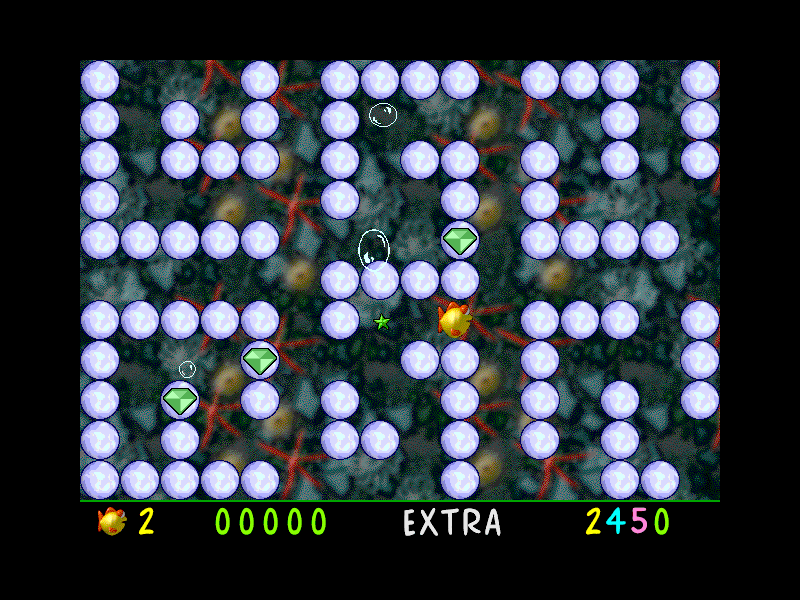

Guide Blinky through an underwater maze and collect treasure. Choose **Don't
Change** at the display prompt, **Not Yet** at the shareware notice, then
**New Game**. Right moves Blinky; controls can be configured in **Prefs**.

This complete original 1.0.0 package retains its 30-day shareware trial.
Bounded native testing covers starting the maze and Right-key movement on both
68K and PPC. PPC additionally displays a Sound Manager warning; choose OK.
The PPC maze background is black rather than the texture visible on 68K.
Scoring, level completion, sustained play and saves remain unverified.
Launch stays disabled pending managed hosting and browser approval.
