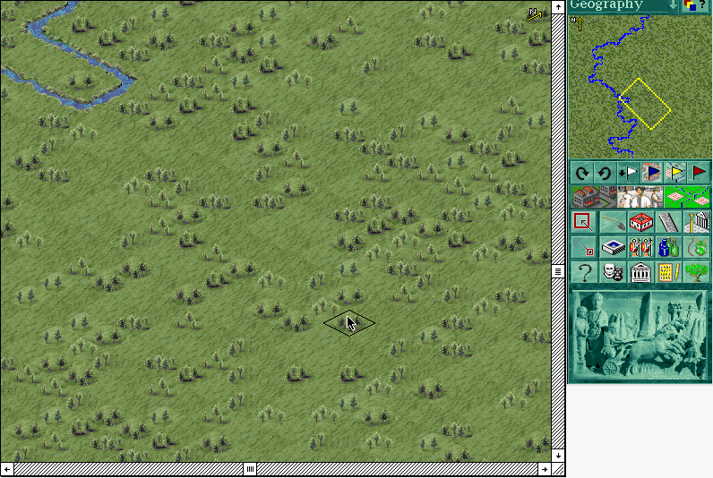

## A frontier city

The demonstration opens on an undeveloped Roman province with a river,
scattered trees, a geography map, and building controls. Once its introductory
messages are dismissed, the calendar advances and the player can inspect the
terrain and available construction tools.

This is the original Macintosh playable demo, not the retail game. Sierra's
included ReadMe says the demo ends after ten years or when the population
reaches 1,000, and saves are disabled. Systemless reaches the live city map
from the unchanged 68K-compatible archive. Browser launch remains disabled
until a manual check is complete.
