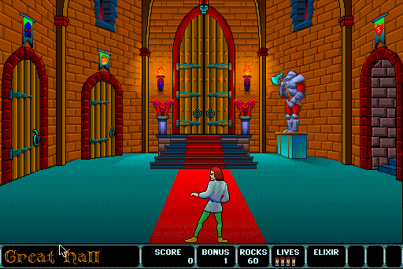

## Through the castle doors

Prince Duncan enters a castle full of guards, bats, traps and famously
unforgiving staircases. Movement is controlled from the keyboard while the
mouse aims his arm, making every thrown rock and narrow jump a deliberate act.
The Great Hall offers several routes into the castle and very little mercy once
the player chooses one.

Delta Tao's color remake keeps the staged rooms, expressive animation and
physical comedy of the 1986 Macintosh original, then redraws the castle in a
rich 256-color palette. Its demo includes the animated difficulty screen and a
playable visit to the Great Hall.

## The contemporary Macintosh demo

This is the purpose-built promotional demo of the 1994 color remake, not either
commercial release. Classic Macintosh Game Demos documents copies distributed
on four period magazine and demo discs and hosts the preserved StuffIt archive
as “Dark Castle Demo.” That archive's files use the same demo name and include
a dedicated launcher and data set.

The catalogue stages the archive without modification. Systemless extracts the
StuffIt package, launches the original 68K demo launcher, advances through the
difficulty screen and enters live play in the Great Hall using the packaged
Color Dark Castle application and data.
