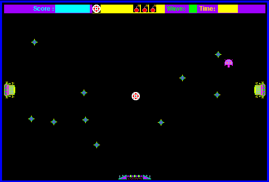

## Chase the next crystal

In Crystal Quest, the ship glides across a single-screen arena under mouse
control. Gather every crystal while avoiding or shooting the aliens, then head
for the exit at the bottom of the playfield. Color makes the tiny enemies,
crystals and portals stand apart against the black background.

This is Casady & Greene's original Macintosh sample, not the retail game.
Holding Option during launch opens a monitor configuration dialog; the sample
can switch to color when the video device supports it. The catalogue preserves
the promotional StuffIt archive byte-for-byte and launches its 68K application.
