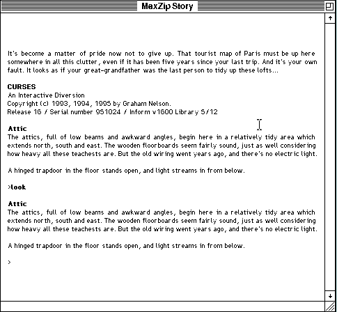

## An attic with a way down

Press **Space** at the welcome screen to begin in the attic. Type a command at
the `>` prompt and press **Return**. Try `look` to examine the room, then
investigate the open trapdoor and the rest of the house.

This release includes the story and its Macintosh MaxZip interpreter in the
original archive. The author permits unchanged, non-profit distribution.
