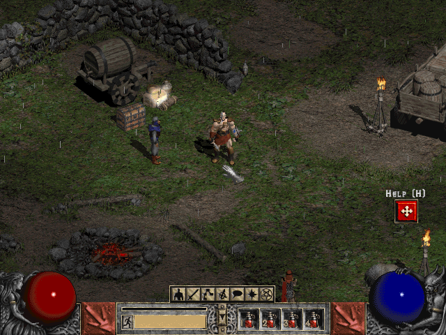

## Return to Sanctuary

This is Blizzard's original version 1.04 Macintosh shareware demo, with its
game data and license preserved in the archive. The original PowerPC game
reaches the starting camp in Systemless. Browser launch remains disabled
until browser performance passes review.

