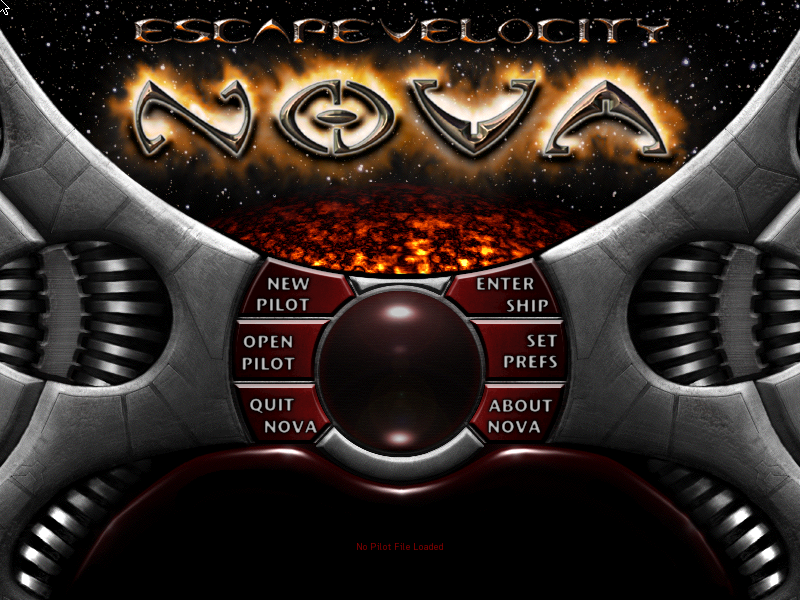

## Source and version

This entry keeps the original, unregistered [EV Nova 1.0.8 shareware archive](https://assets.systemless.org/catalogue/objects/sha256/72/7211ea030bf9dd1a06ed913857281050e514ee03a25b6c918bef5774d6d39c61.sit) intact. The bundled manual describes a 30-day trial, and none of its registration restrictions have been removed.

## Gameplay

## A larger galaxy

Nova gives the series' familiar small-ship freedom a grander, stranger setting. Freight and passenger work can keep you independent for a while, but the Federation, Aurorans, Polaris and Vell-os each offer a genuinely different road through the galaxy. Ships are not merely bigger health bars here: their bays, outfit space and weapon arcs invite distinct ways to fly.
