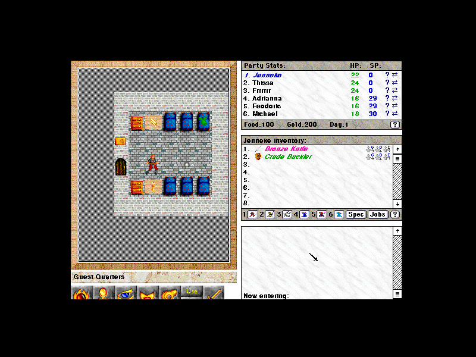

## Back to the surface

After surviving beneath the Empire for years, the people of Exile can finally
seek a return to the surface. But the land above is being devastated by an
unknown force. This entry preserves Spiderweb Software's original Macintosh
demo, not an unlocked or modified edition.

The bundled license allows non-profit sharing of the complete, unchanged demo.
Spiderweb now describes Exile III as free to play and offers free unlocking keys
through its support team; this archive contains no key. The original license
still accompanies the download and sets the terms for unregistered use.

Systemless reaches party creation and the opening Guest Quarters game scene in
a deterministic run. Browser launch remains disabled until the promoted archive
is manually tested in the browser.
