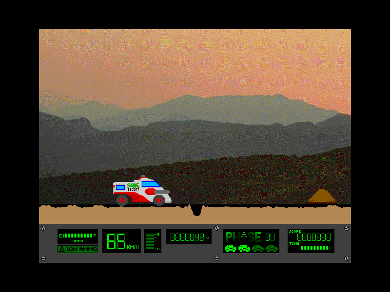

## Shoot before you jump

Choose **File > New Game** to start. The default controls are numeric keypad
**6** to accelerate, **4** to slow down, **0** to jump, and **Space** to fire.
You can change them under **Options > Controls**. Cross eight levels of
craters and mutant creatures while managing your ammunition and time.

The authors released F.A.R.M. Patrol as freeware. The complete original
package includes the README and two sample saved games.
