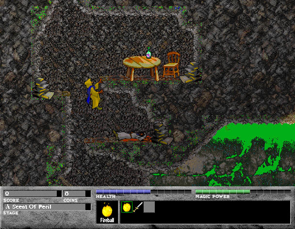

## Enter Teraknorn

Ferazel walks, climbs, digs, and casts spells through the first three levels of
Ambrosia's original demo. The full commercial game is not included.

The bundled manual assigns keypad 4 and 6 to walking, Option to jumping, and
Command to the selected spell or item. This entry sends arrow keys as their
numeric keypad counterparts. Browser launch is awaiting verification.
