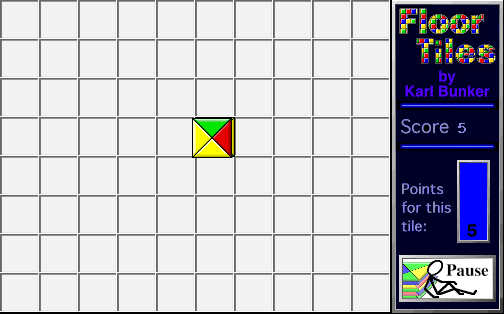

## Match the sides

Dismiss the startup prompts with **OK** and **Not Yet**, then click
**Start Tiles**. Click a square to place the colored tile. Match its edges
with neighboring tiles to build your score. The game includes three related
rulesets and offers board size and timer choices from its menus.
