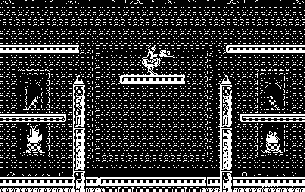

## Egyptian jousting on a classic Mac

Ride a flying bird through Glypha's single-screen arena, trying to take the
higher position over enemies and collect their eggs before they hatch. John
Calhoun's original monochrome game was built for the early Macintosh.

This entry uses the original freely distributed shareware build, not its
modern commercial remake. Systemless reaches the arena; browser launch
awaits manual approval.
