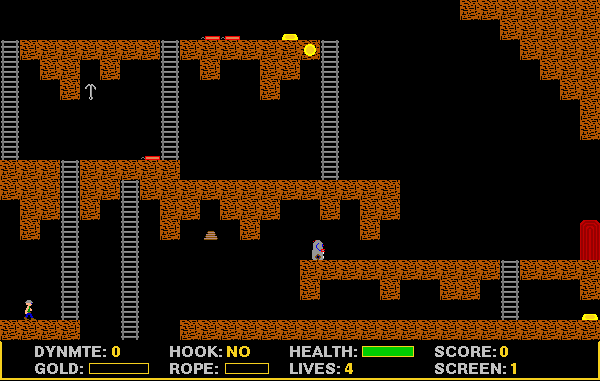

## Enter the lost mines

Dismiss the shareware reminder with **Not Yet**, then choose **New Game**
from the Gold Digger menu. Use **Keypad 4** and **Keypad 6** to move left
and right, **Keypad 8** and **Keypad 2** to climb, and **Keypad 5** to jump.
The bundled game documentation lists the other actions and hazards.
