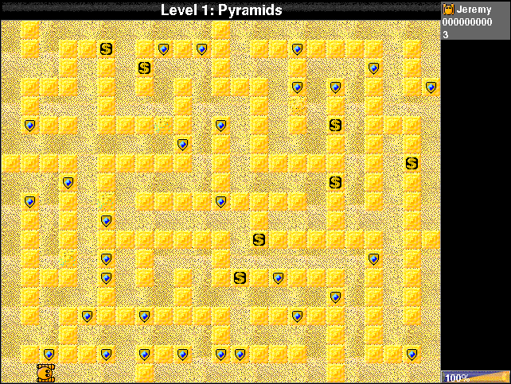

## Clear the maze

Choose **Play**. On first launch, select a player and save the setup, then
choose **Play** again. Jeremy's default numeric-keypad controls are **8** up,
**4** left, **6** right, **2** down, and **0** to push. The setup screen lets
you change those keys. Clear the Greebles and generators to advance.

Greebles is shareware. The bundled documentation asks players who enjoy it
to register; registration removes the periodic reminder screens.
