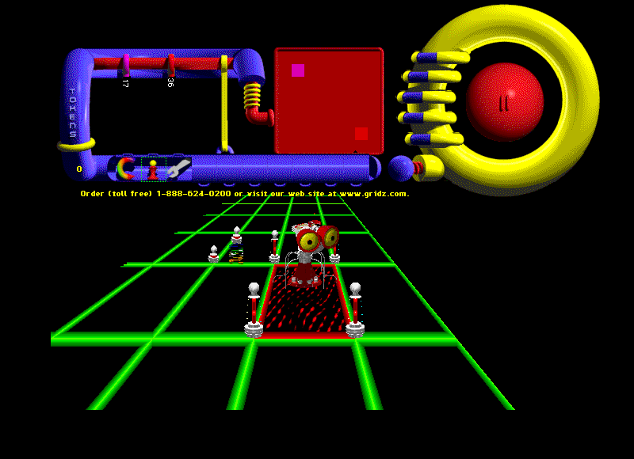

Gridz combines territorial strategy with a three-dimensional board. This entry
preserves the complete version 1.2 demo installer, including its original terms
and data.

The PowerPC version reaches a new game and responds to a board click in bounded
native testing. Longer play and browser gameplay still require validation. The
68K version currently has corrupted title rendering. Browser launch remains
disabled while qualification continues.

