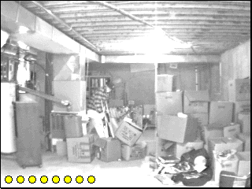

## Pick your targets

Choose **File → New Game** to begin. Click armed targets in the photographed
scene while leaving unarmed people alone. The original freeware package
includes its required `GunslingerRES` picture file.
