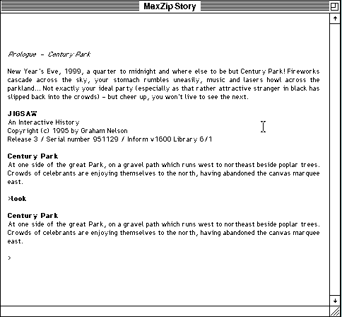

## A century about to turn

Press **Space** at the welcome screen to begin in Century Park. Type a command at
the `>` prompt and press **Return**. Try `look` to examine the park before
exploring the paths around it.

This release includes the story and its Macintosh MaxZip interpreter in the
original archive. The author permits unchanged, non-profit distribution.
