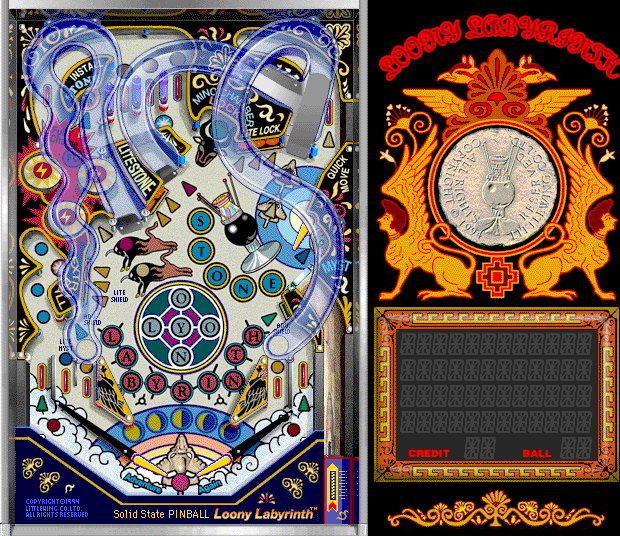

## A pinball maze

LittleWing's colorful table winds through looping ramps, bumpers, and a
labyrinth motif. The original notice identifies this as a promotional demo:
some functions are disabled and play is limited to 90 seconds. It also includes
the contemporary instructions and ordering information.

Systemless reaches the table from the unchanged 68K demo archive. Browser
launch remains disabled until a manual check is complete.
