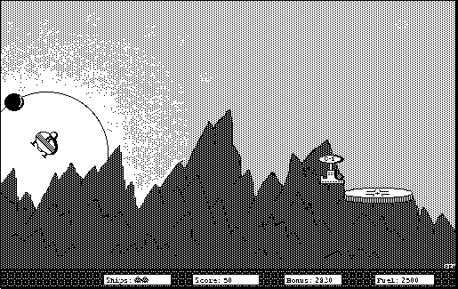

## Fly the lunar course

Choose **New Game** from the **Game** menu. Press **Z** to rotate
counterclockwise, **X** to rotate clockwise, and **Period** to thrust.
The **Instructions** item in the Game menu explains the controls and goal.
