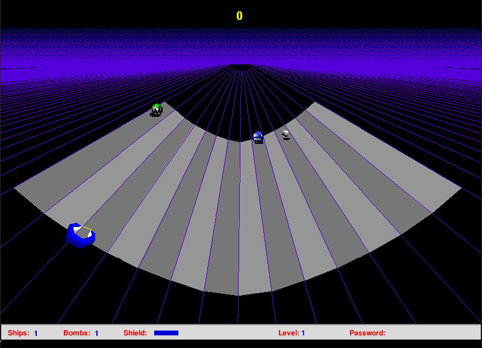

## Navigate the Net

Accept the first-run TurboCharge prompt. If a sound error appears, click Okay
to continue without sound. Use **File > New Game** to start, then move the mouse
to steer. Space activates the shield and Shift uses a smart bomb. The original
demo contains three selected levels.
