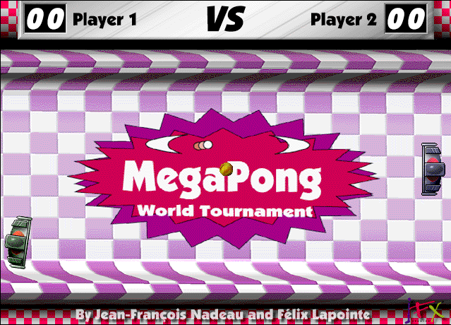

## Rally for the world

Choose **File → New Game** to start. In the default one-player setup, **Q**
moves the left paddle up and **A** moves it down. Keep the golden ball in play.
The **Set Keys** dialog currently fails in Systemless, so use the default
controls.
