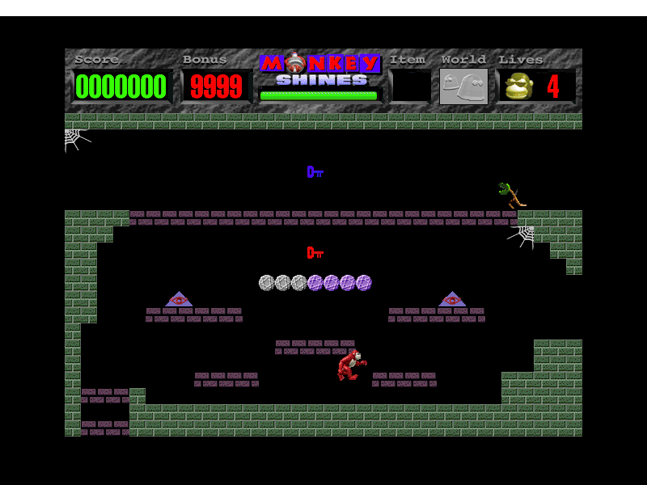

Play the original **Monkey Shines 1.1.2** shareware trial. Choose **Not Yet**,
click the **New Game icon**, then select **Spooked**. Use the **left and right
arrow keys** to walk and the **up arrow** to jump. Collect red keys to reveal
an exit; blue keys lead to bonus rooms.

This complete, unchanged distribution retains the original 30-day trial and
unregistered first-world restriction. The other worlds and third-party levels
require registration and remain locked. No registration code is supplied.

Bounded native 68K testing covers entering the first room, walking and jumping.
Room completion, key collection, sustained play, saves, audio and the editor
remain unverified. The original PPC slice is not yet qualified.
