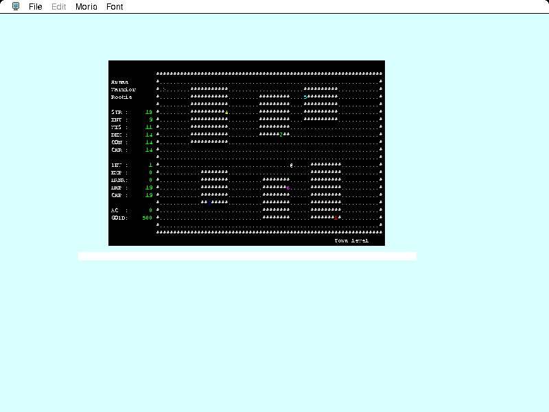

Play the complete original **Purple X Moria 1.1.1** Macintosh port, based on
**UMoria 5.5.2**. Choose **New** from **File**. Pick a race, then **M** or **F**;
**Escape** accepts the rolled statistics. Pick a class, enter a name and press
**Return**, then **Return** again to enter town.

The **arrow keys** are mapped to the numeric keypad for movement. Keypad
**4**, **6**, **8** and **2** move west, east, north and south. On a down staircase,
**>** descends; **Space** acknowledges messages.

The complete original package and its copyright notices are preserved.
Redistribution is recorded under its original educational, research and
nonprofit terms.

Bounded native 68K testing covers character creation, town movement, descent
to 50 feet and movement in the dungeon. Browser and public-route testing,
combat, sustained play, saves and audio remain unverified. This original
package contains no PowerPC version.
