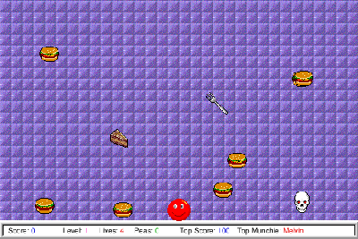

## Eat your way through level one

Melvin follows the mouse while you gather food and dodge skulls and flying
cutlery. Dismiss the shareware notice with **Not yet**, then choose **File →
New Game** to start. Moving the mouse guides Melvin; click to fire after
collecting peapods.

This original shareware package limits some features until registration.
