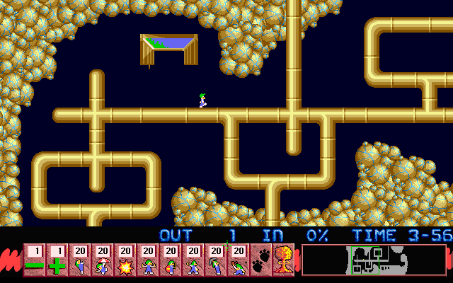

## Citizen Lemming

The first level asks you to save at least half of fifty Lemmings. Assign
limited skills to individual walkers, guide them across the pipe-filled
terrain, and keep an eye on the four-minute clock. This screenshot shows the
first lemming walking after the level begins.

This is Psygnosis's original four-level Macintosh demonstration, not the
100-level retail expansion. Its included Read Me calls it The Demo Disk and
explains the difference. Systemless reached the menu, level briefing, and
live gameplay using the unchanged 68K archive. Browser launch remains disabled
until a manual check is complete.
