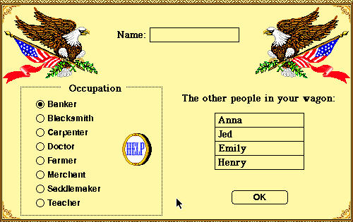

## Pack the wagon

A journey begins with names and consequences. The demo asks the player to name
the wagon leader, choose an occupation and assemble four companions before the
party leaves Independence, Missouri. A banker begins with money to spare; a
carpenter, farmer or teacher accepts a leaner budget in exchange for a larger
score if the party reaches Oregon.

The familiar risks follow that preparation: supplies run down, weather shifts,
rivers have to be crossed and illness can turn a comfortable itinerary into a
crisis. MECC frames those decisions with maps, landmarks and historical notes,
making the westward journey both a strategy game and an educational simulation.

## MECC's downloadable demonstration

This is the 1991 Macintosh edition's promotional demo, not the Apple II release
and not Gameloft's modern successor. Systemless opens MECC's original StuffIt
archive directly, loads its matching colour resources, selects Travel the Trail
and reaches the new-party registration screen. The same deterministic sequence
was cross-checked under BasiliskII.

The preserved MECC product page explicitly offered a Macintosh demo download
and instructions for running it. This catalogue keeps that unchanged package
separate from every retail edition. The launcher remains disabled until the
archive and screenshot complete asset promotion and browser review.
