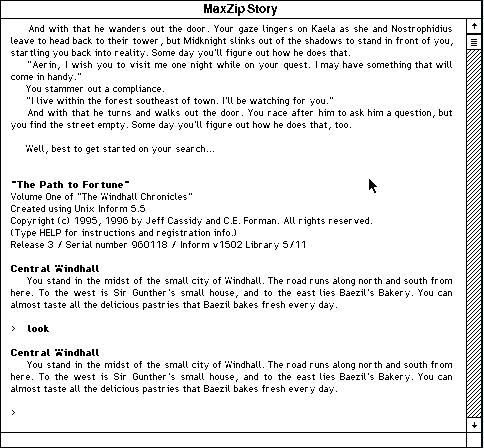

## Windhall needs your help

Answer **N** at the saved-game prompt, then press any key to advance the
introduction. At the `>` prompt in Central Windhall, type a command and press
**Return**. Try `look` to examine the town before exploring its roads.

This release includes the story and its Macintosh MaxZip interpreter in the
original archive. The game may be shared without profit; the separate maps and
hint book are not included.
