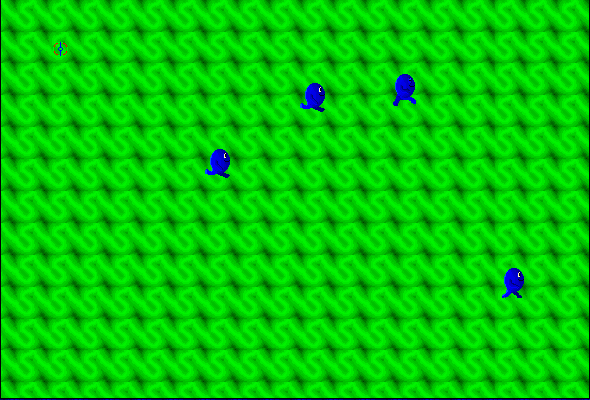

## Hit the moving targets

Choose **Not Yet** at the shareware prompt, then click **Play**. Aim and click
at the creatures crossing the arena. The original package includes its
required Music files.
